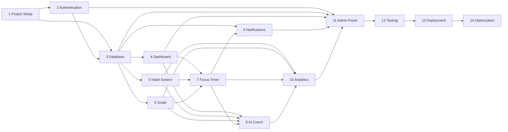

# Focused Implementation Roadmap

**Product:** Focused — Focus Operating System (FocusOS)  
**Status:** Implementation baseline  
**Version:** 1.0  
**Date:** 2026-07-31

## 1. Planning Basis

This roadmap converts the approved Software Requirements Specification, production architecture, Prisma schema, REST contract, and Bangla-first design system into fourteen implementation milestones.

### 1.1 Estimation assumptions

- Estimates are elapsed engineering time, not person-days.
- Reference team: one technical lead, two full-stack engineers, one frontend-focused engineer, one QA/automation engineer, with Product, Design, Security, and DevOps available part-time.
- Work proceeds in two-week iterations with continuous discovery, review, testing, documentation, and deployment to preview environments.
- All milestones include unit, integration, accessibility, security, and regression work appropriate to their scope. Milestone 12 adds system-wide hardening; it does not postpone quality until the end.
- Estimates assume timely access to Vercel, Neon, Cloudinary, Upstash/QStash, OAuth, Groq, Gemini, SonarQube, and Web Push credentials.
- Sequential duration is approximately 31–35 weeks. With the parallel work identified below, the target calendar duration is 26–30 weeks before post-launch optimization.
- Estimates should be recalibrated after Milestones 1, 4, 8, and 12 using measured throughput and defect data.

### 1.2 Delivery principles

1. Ship vertical slices through UI, REST API, application use case, domain policy, persistence, telemetry, and tests.
2. Keep the first backend a Clean Architecture modular monolith in Next.js Route Handlers; extract FastAPI only when a proven Python-specific boundary exists.
3. Treat PostgreSQL as authoritative. Redis is limited to reconstructable cache, rate limiting, and coordination data.
4. Keep Groq and Gemini behind a provider-neutral AI gateway. Free quotas are development aids, not a production capacity or privacy guarantee.
5. Default all product copy to native-authored `bn-BD`; maintain English parity and the approved English technical-term glossary.
6. Enforce private-by-default behavior, explicit AI consent, least privilege, immutable privileged-action audit, and accessible interaction without a special mode.
7. Generate REST reference documentation from the versioned OpenAPI contract. OpenAPI describes Focused endpoints and is unrelated to OpenAI.

### 1.3 Milestone dependency map

Milestones 5 and 6 can run in parallel after the shared database foundation. Notification infrastructure can begin beside Milestone 8 after the Timer event contract is stable. Admin read models can begin during Analytics, but privileged actions cannot close before Authentication and audit controls are complete.

## 2. Milestone 1 — Project Setup

### Objectives

- Establish a production-grade monorepo and architectural boundaries.
- Make every change lintable, testable, buildable, observable, and deployable to a preview environment.
- Install the Bangla-first design, localization, security, and API foundations before feature work.

### Tasks

- Create the `apps/web` Next.js application using the App Router, React, strict TypeScript, Tailwind CSS, and shadcn/ui.
- Create feature-oriented `domain`, `application`, `infrastructure`, `api`, `components`, `lib`, and `i18n` boundaries with dependency checks.
- Configure pnpm, pinned Node version, lockfile, strict TypeScript, ESLint, Prettier, Stylelint, Husky/lint-staged where justified, and path aliases.
- Integrate semantic design tokens, light/dark themes, Noto Sans Bengali, focus treatment, reduced motion, and responsive application shell primitives.
- Configure `bn-BD` as the default locale, English as secondary, locale-aware routes, native copy dictionaries, formatting utilities, and missing-key checks.
- Define environment validation with typed server-only variables and fail-fast startup behavior.
- Implement shared error envelopes, request IDs, correlation IDs, structured redacted logging, health endpoint, and telemetry interfaces.
- Add REST route conventions, Zod request/response validation, API versioning, idempotency conventions, and OpenAPI generation/validation.
- Establish baseline security headers, CSP reporting mode, CSRF strategy, dependency scanning, secret scanning, and secure cookie helpers.
- Configure Vitest, React Testing Library, Playwright, MSW/test doubles, accessibility automation, and coverage reporting.
- Add GitHub Actions for install, lint, type-check, unit tests, build, OpenAPI validation, and SonarQube scan.
- Create local development instructions, architecture rules, contribution guide, ADR template, and environment example file without secrets.

### Estimated Time

**1.5–2 weeks**

### Deliverables

- Runnable Next.js application shell with Bangla default, English switching, responsive navigation, and light/dark themes.
- Enforced feature-based Clean Architecture folder structure.
- CI quality gate and preview-ready build.
- Validated API/error conventions and generated REST documentation baseline.
- Developer onboarding and architecture documentation.

### Dependencies

- Approved SRS, architecture, UI design system, initial REST contract, and tool accounts.
- Decisions on package manager, Node LTS version, Vercel region, and primary Neon region.

### Testing

- CI runs lint, formatting check, strict type-check, unit tests, production build, dependency audit, OpenAPI validation, and SonarQube analysis.
- Playwright smoke tests verify landing, locale switch, theme switch, keyboard navigation, 320 px layout, and no critical axe violations.
- Architecture tests reject imports from Domain into Next.js, Prisma, providers, or UI code.
- Environment tests prove missing or malformed required variables fail safely without leaking values.

### Definition of Done

- A new engineer can clone, configure, test, and run the application from documented steps.
- `main` protection requires green CI and review; no secret or `.env` file is committed.
- Production build succeeds with zero TypeScript errors, zero lint errors, and no unresolved high-severity dependency finding.
- Bangla and English render correctly across light/dark and mobile/desktop shells.
- All shared errors include stable code, localized safe message, and correlation ID.

## 3. Milestone 2 — Authentication

### Objectives

- Deliver secure registration, sign-in, OAuth, token rotation, session management, account recovery, and role-aware authorization.
- Establish identity without coupling business modules to authentication infrastructure.

### Tasks

- Implement User, credential identity, OAuth account, Session, RefreshTokenFamily, verification, recovery, consent, role, permission, and audit models required by authentication.
- Implement Argon2id password hashing, password policy, email verification, reset tokens, replay-safe one-time tokens, and generic anti-enumeration responses.
- Issue short-lived JWT access tokens and rotating opaque refresh tokens; store refresh tokens as hashes in HttpOnly, Secure cookies.
- Keep browser access tokens in memory; implement refresh single-flight, family reuse detection, revocation, logout, logout-all, and device/session listing.
- Integrate approved OAuth providers with Authorization Code + PKCE, signed state/nonce, exact redirect validation, and safe account linking.
- Implement RBAC policy checks in application use cases and API adapters, not only hidden UI controls.
- Add authentication rate limits, risk signals, security-event logging, step-up hooks, and safe lockout/backoff behavior.
- Build accessible Bangla-first sign-up, sign-in, verification, forgot/reset password, OAuth callback, session management, and recovery states.
- Implement profile bootstrap, locale/time-zone capture, minimal onboarding state, and acceptance of current legal/consent versions.
- Document token lifetimes, cookie policy, key rotation, compromised-session response, and support procedures.

### Estimated Time

**2.5–3 weeks**

### Deliverables

- Complete local and OAuth authentication flows.
- JWT/refresh rotation and revocation service.
- RBAC authorization policies and route guards.
- Session/device management UI and security audit events.
- Authentication-specific Prisma migrations and generated REST documentation.

### Dependencies

- Milestone 1.
- OAuth applications, email delivery sandbox, signing/encryption keys, public URLs, and approved token/cookie policy.
- Milestone 2 owns the minimum identity migrations; Milestone 3 expands and hardens the complete domain database.

### Testing

- Unit tests cover password, token, cookie, state/nonce, permission, expiry, and clock-skew policies.
- Integration tests cover registration, verification, login, refresh rotation, concurrent refresh, token replay, revocation, OAuth callback, recovery, and logout-all.
- Security tests cover enumeration, CSRF, XSS-sensitive token storage, open redirects, session fixation, brute force, privilege escalation, and forged JWTs.
- Playwright tests cover mouse, keyboard, screen reader labels, validation recovery, loading, offline, expired-link, and mobile flows in both locales.

### Definition of Done

- No authenticated endpoint trusts client-submitted identity, role, or tenant scope.
- Refresh-token replay revokes the affected family and records an actionable security event.
- Revoked sessions cannot refresh; permission changes take effect within the documented bound.
- Authentication flows pass the threat-model review and critical security test suite.
- Sensitive tokens never appear in URLs, client persistence, logs, analytics, or error responses.

## 4. Milestone 3 — Database

### Objectives

- Establish Neon PostgreSQL and Prisma as a reliable, scalable transactional foundation for all approved domains.
- Enforce ownership, invariants, migration safety, auditability, idempotency, and efficient access paths.

### Tasks

- Review the complete Prisma schema against the SRS; split physical persistence models from domain entities through repository mappers.
- Configure pooled runtime `DATABASE_URL`, direct migration URL, connection limits, timeouts, and region colocation.
- Create reviewed migrations for identity, preferences, planning, habits/trackers, focus sessions, AI metadata, notifications, analytics projections, gamification ledger, admin audit, inbox/outbox, and jobs.
- Implement UUID/ID strategy, UTC timestamp policy, member time-zone conversion, soft-delete rules where justified, and data-retention classifications.
- Add ownership predicates, compound uniqueness, foreign keys, check constraints where supported, optimistic concurrency/version columns, and cascade/restrict policies.
- Add indexes for dashboard, due habit occurrences, active Timer sessions, goal hierarchy, reminders, notification inbox, analytics ranges, and admin lookup paths.
- Implement transactional outbox, webhook inbox, idempotency records, job metadata, and replay-safe repository contracts.
- Create seed data limited to configuration, roles, permissions, metric definitions, and development-only synthetic accounts.
- Add migration validation, schema drift detection, rollback/roll-forward runbooks, branch-per-preview strategy, and sanitized test fixtures.
- Define archival/partition thresholds and query budgets without prematurely partitioning low-volume tables.
- Add encrypted-field adapter seams for any approved highly sensitive values; keep provider secrets outside PostgreSQL.

### Estimated Time

**2–2.5 weeks**

### Deliverables

- Reviewed Prisma schema and migration history.
- Repository interfaces/adapters with domain mapping.
- Seed, fixture, migration, restore, and data-retention documentation.
- Index/query plan report for defined hot paths.
- Transactional outbox, idempotency, and ownership enforcement foundations.

### Dependencies

- Milestones 1–2.
- Neon projects/branches, regional decision, retention policy, and data classification approval.

### Testing

- Repository contract tests run against isolated Neon/PostgreSQL databases, not in-memory substitutes.
- Migration tests apply from zero and from the latest production-like baseline; destructive changes require expand/migrate/contract proof.
- Concurrency tests cover duplicate commands, optimistic conflicts, idempotency replay, token rotation, and Timer start races.
- Query tests inspect representative plans and fail on N+1 access or unbounded scans in declared hot paths.
- Backup/restore rehearsal validates schema, configuration, ownership, and representative data relationships.

### Definition of Done

- All P0 domain records have explicit ownership, constraints, repository contracts, and tested migrations.
- Runtime uses pooled connections; migrations use a protected direct connection and never run at function startup.
- A clean database can be created reproducibly; drift detection is green.
- Hot-path query plans meet documented budgets on representative data volumes.
- No production data is required or copied to local/test/preview environments.

## 5. Milestone 4 — Dashboard

### Objectives

- Provide a calm, actionable home that answers what matters now, what is next, and whether attention needs correction.
- Create projection/read-model patterns reused by later features.

### Tasks

- Implement DashboardSnapshot and widget-preference read models with versioning and stale-state metadata.
- Build server-rendered Dashboard route, REST endpoints, application queries, and cache policy with authenticated `private/no-store` defaults where needed.
- Implement primary focus card, today priorities, active/upcoming Focus Session, habit summary placeholder, goal summary, weekly progress, reminders, and AI panel boundary.
- Implement customizable widget visibility/order without allowing an overloaded or inaccessible layout.
- Add loading skeletons, first-use guidance, meaningful empty states, partial failure, stale data, offline snapshot, retry, and permission-safe redaction.
- Add responsive mobile bottom navigation, tablet rail, desktop sidebar/content/context panel, and persistent but non-authoritative UI preferences.
- Implement Bangla-first dashboard copy and English parity with date, number, time-zone, and plural formatting.
- Emit safe dashboard performance/usage telemetry without journal, note, mood, health, faith, or AI prompt content.
- Add projection update events and reconciliation for goals, habits, sessions, reminders, and analytics as those modules arrive.

### Estimated Time

**2–2.5 weeks**

### Deliverables

- Production Dashboard page across mobile, tablet, and desktop.
- Dashboard REST endpoints and projection pipeline.
- Widget preference controls and shared card/state primitives.
- Bangla/English copy, Storybook stories, telemetry, and documentation.

### Dependencies

- Milestones 1–3.
- Final Dashboard information hierarchy and privacy rules from the design system.
- Some widgets initially use well-defined empty/not-configured states until their source milestones ship.

### Testing

- Unit tests cover projection composition, widget rules, stale calculation, privacy filtering, and locale formatting.
- Integration tests cover owner isolation, partial projection failure, cache invalidation, and event replay.
- Visual regression covers both themes/locales at 320, 768, 1024, 1280, and 200% zoom.
- Playwright covers keyboard order, screen-reader landmarks, first-use/empty/loading/error/offline states, and widget changes.
- Performance test verifies bounded query count and target server response with representative widget data.

### Definition of Done

- The first viewport contains one unambiguous primary action and no sensitive generic preview.
- Dashboard remains usable when any noncritical widget source is unavailable.
- No widget bypasses source-domain authorization or queries unbounded raw history.
- Mobile, tablet, desktop, Bangla, English, light, dark, keyboard, and screen-reader acceptance tests pass.
- Projection freshness and degradation are visible, measurable, and recoverable.

## 6. Milestone 5 — Habit System

### Objectives

- Deliver flexible, psychologically safe habit tracking and a reusable typed tracker foundation.
- Calculate due occurrences, adherence, pauses, streak evidence, and time-zone behavior deterministically.

### Tasks

- Implement Habit aggregate, schedule versions, targets, occurrence generation, entries, pause periods, archive, notes/evidence references, and completion correction.
- Support daily, selected weekday, interval, target-count, and bounded custom schedules without unrestricted rule complexity.
- Build create/edit/archive/pause/resume/check-in/history flows and REST endpoints with optimistic UI and idempotent writes.
- Handle member time-zone changes, DST, travel, missed occurrences, backdated corrections, schedule edits, and midnight boundaries.
- Create generic TrackerDefinition/TrackerEntry seams for learning, programming, LeetCode, reading, Quran, prayer, workout, sleep, and mood without shipping all specialized experiences prematurely.
- Add non-shaming streak and consistency presentation, skip/pause semantics, undo, and reduced-gamification preference hooks.
- Publish HabitEntryRecorded, HabitScheduleChanged, and HabitPaused events to dashboard, analytics, reminders, and gamification consumers.
- Add safe offline capture with client command IDs, Sync status, conflict resolution, and clear correction UI.
- Implement native Bangla labels and culturally appropriate schedule/date language; retain approved technical terms in English.

### Estimated Time

**2.5–3 weeks**

### Deliverables

- Habit CRUD, scheduling, check-in, pause, history, and correction experiences.
- Habit REST API, domain policies, repositories, events, and occurrence worker.
- Generic tracker foundation and extension guide.
- Offline/Sync behavior and habit projection integration.

### Dependencies

- Milestones 1–4.
- Durable job callback foundation for occurrence expansion; notification delivery itself arrives in Milestone 9.

### Testing

- Property-based tests cover schedule/occurrence generation across leap years, DST, time-zone changes, pauses, edits, and target types.
- Integration tests cover idempotent check-ins, concurrent correction, owner isolation, offline replay, archive, and event publication.
- Accessibility tests cover compact checkboxes, larger hit areas, status alternatives, keyboard reordering, and 200% zoom.
- UX tests verify missed habits are neutral, paused periods are not failures, and destructive archive/delete actions are explicit.
- Load tests validate due-occurrence and history queries on representative member/habit volumes.

### Definition of Done

- The same occurrence cannot be double-counted under retries or offline replay.
- Schedule versioning preserves historical truth after edits.
- Paused or not-due days never reduce adherence or create false failure.
- Habit pages cover loading, empty, error, conflict, offline, archived, and inaccessible-resource states.
- Dashboard and event consumers update idempotently after habit changes.

## 7. Milestone 6 — Goals

### Objectives

- Connect long-term direction to goals, milestones, measurable outcomes, weekly commitments, and daily action.
- Preserve user agency: AI may propose, but only the member changes goal state or commitments.

### Tasks

- Implement private Life Vision, Goal, GoalMilestone, KeyResult, GoalLink, CheckIn, status transition, archive, and evidence models.
- Define goal state machine, progress calculation policies, weighted/manual progress rules, overdue semantics, and optimistic concurrency.
- Build goal list/detail/create/edit/check-in/archive experiences and REST endpoints.
- Support hierarchy without cycles, bounded nesting, ordering, search/filter, due dates, priorities, and linked habits/Focus Sessions.
- Implement weekly planning foundation: prior-week reflection, capacity, fixed commitments, selected outcomes, risk/balance check, draft/final states.
- Add future seams for monthly/yearly planning, calendar allocation, and smart scheduling without overbuilding them.
- Publish goal/check-in/plan events to Dashboard, Analytics, AI, and Notifications.
- Implement privacy-safe sharing as an explicit future seam; goals remain private by default in this milestone.
- Add native Bangla goal/planning copy with locale-aware dates and accessible form guidance.

### Estimated Time

**2.5–3 weeks**

### Deliverables

- Goal and milestone management with measurable check-ins.
- Life Vision and weekly planning MVP.
- Goal linking to habits and Focus Sessions.
- Goal REST API, domain state machines, events, and accessible responsive UI.

### Dependencies

- Milestones 1–4; can run in parallel with Milestone 5 after database contracts stabilize.
- Calendar integration is not required for Done; fixed commitments may be entered manually until a later integration slice.

### Testing

- Unit tests cover state transitions, hierarchy cycle prevention, progress math, dates, capacity limits, and AI proposal boundaries.
- Integration tests cover owner isolation, concurrent edits, event replay, linked-record deletion behavior, and draft/final weekly plans.
- Playwright covers keyboard goal editing, accessible validation, hierarchy navigation, 320 px/mobile planning, and all UI states.
- Security tests verify private-by-default access and prevent mass-assignment of owner, status, progress, or role fields.

### Definition of Done

- Goal transitions are enforced in Domain/Application code and cannot be bypassed through REST payloads.
- Historical check-ins remain auditable after goal changes.
- Weekly capacity warnings explain the conflict without blocking user agency.
- AI/provider code is not required to complete any goal or planning workflow.
- Dashboard receives correct, idempotent goal and weekly-plan projections.

## 8. Milestone 7 — Focus Timer

### Objectives

- Deliver authoritative Deep Work Timer and Pomodoro workflows that survive refresh, reconnect, multi-device use, and serverless execution.
- Capture outcomes and distractions without turning attention management into busywork.

### Tasks

- Implement FocusSession aggregate and state machine: planned, running, paused, resumed, completed, cancelled, abandoned, and reconciled.
- Derive elapsed time from authoritative timestamps; never persist browser tick counts as truth.
- Implement Deep Work presets, custom duration, Pomodoro work/break cycles, long break policy, automatic/manual transition preference, and interruption rules.
- Build Timer controller, compact floating Timer, full session view, completion/reflection dialog, audible/vibration controls, and Screen Reader announcements at meaningful events only.
- Add goal, daily priority, and habit links; capture outcome, interruption count, distraction category, optional notes, and explicit privacy.
- Implement heartbeat/lease or optimistic conflict strategy for multiple tabs/devices, clock drift handling, reconnect, expired session reconciliation, and server time endpoint if needed.
- Add service-worker/offline behavior that preserves local continuity and queues a replay-safe completion command.
- Publish FocusSession events to Dashboard, Analytics, XP/streak ledgers, reviews, and reminders through the outbox.
- Enforce browser power/background limitations honestly; do not promise continuous JavaScript execution.

### Estimated Time

**2.5–3 weeks**

### Deliverables

- Deep Work Timer and Pomodoro experiences.
- FocusSession API, state machine, reconciliation, and event contracts.
- Distraction logging and session completion review.
- Accessible audio/vibration/reduced-motion/offline/multi-device controls.

### Dependencies

- Milestones 1–6.
- PWA/service-worker foundation and shared outbox/idempotency infrastructure.

### Testing

- Fake-clock unit tests cover pause/resume, cycles, clock drift, DST, background duration, expiry, and transition invariants.
- Integration tests cover duplicate start, multiple tabs, reconnect, offline completion, retry, stale version, and event publication.
- Playwright tests run accelerated Timer scenarios without real-time waiting and verify refresh/reopen recovery.
- Accessibility tests verify large numerals, non-color state, keyboard-only control, focus return, announcements, reduced motion, and 200% zoom.
- Reliability tests kill/restart clients and replay commands to prove a completed session is never duplicated or lost.

### Definition of Done

- Refreshing or reopening the application reconstructs the same authoritative Timer state within one second under normal conditions.
- Start, pause, resume, complete, and cancel are idempotent and reject invalid transitions.
- UI interaction acknowledges locally within the performance target and reconciles without visible jumps beyond the documented limit.
- A Focus Session remains completable without AI, push permission, or network continuity.
- Dashboard and downstream events reflect each terminal session exactly once.

## 9. Milestone 8 — AI Coach

### Objectives

- Deliver a consent-driven, explainable AI Coach and Daily Review using Groq and Gemini without provider lock-in.
- Prevent AI from silently changing user data or receiving disallowed sensitive context.

### Tasks

- Define provider-neutral ports for streaming generation, structured output, embeddings where approved, safety signals, usage, cancellation, and normalized errors.
- Implement Groq adapter for latency-sensitive coaching/classification/short summaries and Gemini adapter for approved long-context review; make routing configuration-driven.
- Build policy engine for data classification, consent scopes, allowed context categories, purpose, provider/tier, model, region, retention, and fallback.
- Implement prompt registry with versioning, Bangla/English system instructions, structured schemas, evaluation metadata, and rollback.
- Build context assembler from authorized projections; exclude raw journals, notes, mood, health, sleep, faith, or private content unless separately and explicitly granted.
- Implement AI Coach conversation, Daily Review, suggestion cards, evidence/source labels, edit/apply/decline, and “AI unavailable” deterministic fallbacks.
- Require explicit confirmation for every proposed plan/task/goal/reminder mutation; record proposal and final member decision.
- Implement streaming lifecycle, cancellation, retry, provider timeout, quota/rate limit, circuit breaker, safe fallback, and asynchronous review jobs.
- Add per-user/provider/model budgets, abuse controls, token accounting, quota telemetry, and cost caps using Redis only for ephemeral enforcement.
- Implement prompt-injection defenses for imported/user content, output schema validation, content safety, privacy-redacted logs, and deletion/retention jobs.
- Create representative native Bangla evaluation set reviewed by a native editor; do not use machine translation as acceptance evidence.

### Estimated Time

**3–4 weeks**

### Deliverables

- Provider-neutral AI gateway with Groq and Gemini adapters.
- AI Coach chat and AI Daily Review vertical slices.
- Consent/context controls, proposal approval workflow, quota controls, and safe fallbacks.
- Prompt registry, evaluation harness, telemetry dashboard, and provider runbooks.

### Dependencies

- Milestones 1–7.
- Approved Groq/Gemini accounts, data-processing/privacy review, model allowlist, quota policy, and Bangla editorial reviewer.
- Gemini unpaid service must not receive sensitive Focused member content; production routing must enforce policy, not rely on developer convention.

### Testing

- Contract tests run both adapters against recorded/synthetic fixtures and verify normalized streaming, errors, rate limits, and cancellation.
- Policy tests enumerate data classification × consent × provider/tier × purpose and fail closed on missing rules.
- Evaluation suite measures Bangla naturalness, instruction adherence, factual grounding, unsupported claims, harmful advice, refusal quality, and action-proposal validity.
- Adversarial tests cover prompt injection, data exfiltration, cross-user context, malformed structured output, provider outage, quota exhaustion, and fallback privacy.
- End-to-end tests prove no mutation occurs until explicit user confirmation and every applied change uses the normal authorized use case.

### Definition of Done

- Feature and API code depend only on AI ports, never Groq/Gemini SDKs directly.
- Every provider request has an auditable purpose, model, prompt version, policy decision, consent scope, and redacted usage record.
- Disallowed sensitive context cannot reach an unapproved provider, including through fallback.
- Users can inspect, edit, reject, or apply suggestions; “AI said so” is never the only explanation.
- AI failure degrades to a usable non-AI experience without losing user data.

## 10. Milestone 9 — Notifications

### Objectives

- Deliver reliable, private, preference-aware in-app notifications, reminders, and Web Push.
- Separate durable scheduling state from provider delivery and browser availability.

### Tasks

- Implement Notification, NotificationPreference, PushSubscription, ReminderRule, ReminderOccurrence, DeliveryAttempt, template version, and dead-letter/reconciliation models.
- Build in-app inbox with read/unread, pagination, categories, deep links, empty/error/offline states, and safe preview content.
- Implement Web Push subscription lifecycle, VAPID keys, permission education, endpoint rotation, invalid-subscription cleanup, and test notification.
- Build reminder rule editor for habits, goals, Focus Sessions, plans, prayers/trackers where approved, quiet hours, time zone, snooze, skip, and urgency.
- Expand future occurrences through durable signed jobs; enqueue delivery through QStash/Workflow and handle retries, deduplication, expiry, and provider receipts.
- Keep lock-screen payloads minimal; fetch authorized details after opening the app.
- Implement preference snapshots at send time and recheck critical privacy/authorization before deep-link display.
- Add AI Smart Reminder only as an optional proposal/ranking layer that respects frequency caps, quiet hours, consent, and deterministic fallback.
- Build operational delivery health, queue-age, retry, DLQ, and subscription-cleanup telemetry.

### Estimated Time

**2.5–3 weeks**

### Deliverables

- In-app notification inbox and Web Push delivery.
- Reminder Engine with durable occurrences, retries, deduplication, quiet hours, and preferences.
- Optional policy-governed AI Smart Reminder proposal.
- Delivery monitoring, reconciliation, and runbooks.

### Dependencies

- Milestones 1–8; core notification work can begin after Milestone 7 events stabilize.
- VAPID credentials, HTTPS preview environment, durable queue provider, and browser/device test matrix.

### Testing

- Unit/property tests cover recurrence, quiet hours, DST, time-zone moves, snooze, skip, caps, and preference precedence.
- Integration tests cover duplicate callbacks, retry/backoff, expired endpoint, permission revocation, DLQ/reconciliation, and deep-link authorization.
- Browser/device tests cover Chromium, Firefox where supported, Android PWA, denied/dismissed permission, and iOS installed-PWA constraints where supported.
- Privacy tests confirm lock-screen content reveals no goal, journal, mood, health, faith, or private note details.
- Load tests validate occurrence expansion and burst delivery without database scans or provider stampedes.

### Definition of Done

- A logical reminder occurrence is delivered no more than once per channel under retry.
- Quiet hours, opt-outs, category/channel preferences, and privacy-safe payload rules are enforced server-side.
- Notification failure never changes the underlying habit, goal, plan, or Focus Session state.
- Invalid subscriptions are retired automatically and delivery failures are observable/reconcilable.
- The product remains fully usable when Web Push is unsupported or denied.

## 11. Milestone 10 — Analytics

### Objectives

- Turn focus, habit, goal, distraction, and review events into understandable private insights.
- Avoid raw-table scans, shame-based metrics, color-only charts, and unverifiable AI interpretations.

### Tasks

- Define metric catalog, calculation/version policy, event inputs, time-zone cutoffs, comparison rules, and data-quality states.
- Implement incremental daily/weekly/monthly projections for focus duration, completion, habit consistency, goal progress, distractions, planning capacity, and review completion.
- Build Focus Analytics, Distraction Analytics, comparison controls, filters, chart/table alternatives, drill-down, empty/partial/stale/error states, and metric explanations.
- Add Reports and Export jobs with queued generation, progress, expiry, authorization, locale-aware CSV/PDF/JSON formats, and deletion.
- Implement XP, level, achievement, and streak ledgers as immutable/idempotent derived events with reduced-gamification controls; do not make them authoritative productivity data.
- Add AI interpretation only from approved aggregates, clearly separating observed metrics from inferred suggestions.
- Implement analytics privacy exclusions, minimum aggregation rules, member deletion/rebuild, projection reconciliation, and versioned backfill jobs.
- Add operational metrics without high-cardinality or private content labels.

### Estimated Time

**3–3.5 weeks**

### Deliverables

- Focus and Distraction Analytics pages and APIs.
- Versioned projection pipeline, metric catalog, and reconciliation jobs.
- Progress reports and controlled export workflow.
- Optional gamification ledger and member controls.
- Accessible charts with equivalent data tables and explanations.

### Dependencies

- Milestones 3–9; useful analytics requires stable habit, goal, Timer, AI-review, and notification event contracts.
- Product approval of metric definitions and anti-shame language.

### Testing

- Golden-data tests verify every metric against hand-calculated fixtures across locales, time zones, DST, missing data, and corrected events.
- Idempotency/replay tests rebuild projections from events and compare checksums with incremental results.
- Query/load tests validate bounded response time across representative multi-year history and high-volume event sets.
- Accessibility tests verify keyboard-accessible filters/tooltips, non-color encodings, chart descriptions, tables, reflow, and export access.
- Privacy tests prove raw private text is unnecessary, excluded categories remain excluded, and cross-user/report access is impossible.

### Definition of Done

- Each visible metric has a versioned definition, inputs, time range, comparison basis, and accessible explanation.
- Projection rebuild is deterministic and safe to retry.
- Charts have equivalent tables; status is not communicated by color alone.
- Reports/exports expire, require authorization on download, and record safe audit evidence.
- Analytics uses projections/indexed queries and meets documented response/query budgets.

## 12. Milestone 11 — Admin Panel

### Objectives

- Provide safe platform operations without routine access to private member content.
- Enforce least privilege, step-up authentication, reason codes, immutable audit, and separation of duties.

### Tasks

- Implement Support Administrator, Platform Administrator, Content Curator, and Auditor permission sets with deny-by-default policies.
- Build Admin shell and read models for user/account status, role assignments, feature flags, jobs/DLQ, delivery health, AI provider health/quotas, translation review, news/resource configuration, gamification rules, and system health.
- Mask or omit private fields; implement exceptional-access workflow only if legally/product-approved, with case, reason, step-up, time limit, and prominent audit.
- Add account disable/restore, session revocation, verified email/support corrections, role change, feature rollout, retry/reconcile, and content configuration use cases.
- Require confirmation sequence, current password/passkey/OAuth step-up where appropriate, reason code, correlation ID, and audit event for privileged changes.
- Implement pagination, saved filters without private data, safe CSV export limits, stale state, partial provider failure, and empty/error/loading states.
- Add tamper-evident append-only audit storage/retention policy and auditor views without mutation capability.
- Add impersonation only if separately approved; otherwise explicitly prohibit and test absence.

### Estimated Time

**2–2.5 weeks**

### Deliverables

- Role-specific Admin Panel and APIs.
- Feature flag/configuration, system health, job operations, and safe support workflows.
- Step-up authentication and immutable privileged-action audit.
- Admin security matrix, operational runbooks, and access review procedure.

### Dependencies

- Milestones 1–10, especially authentication/RBAC, audit data, provider telemetry, and projection health.

### Testing

- Permission-matrix tests execute every admin endpoint for every role and confirm deny-by-default behavior.
- Security tests cover IDOR, mass assignment, hidden UI bypass, CSRF, stale step-up, role escalation, audit omission, and export leakage.
- Integration tests prove every privileged read/write requiring a reason creates an immutable audit event in the same durable workflow.
- Accessibility/visual tests cover dense tables, pagination, filters, dialogs, confirmations, 200% zoom, and mobile fallback.
- Chaos tests verify provider/job/database partial failures render safe operational states without exposing secrets.

### Definition of Done

- No role can access an operation absent from its explicit policy.
- Routine Admin views contain no journal, private note, mood, health, faith, unrestricted AI conversation, or secret values.
- Privileged operations require the defined step-up/reason sequence and produce queryable immutable audit evidence.
- Destructive/bulk operations are idempotent, bounded, recoverable where possible, and never triggered by GET.
- Admin access and audit retention pass security and Product/Legal review.

## 13. Milestone 12 — Testing

### Objectives

- Prove the integrated FocusOS meets functional, security, accessibility, reliability, performance, localization, and data-integrity requirements.
- Convert known risk into automated regression protection and launch evidence.

### Tasks

- Complete requirements traceability from SRS acceptance criteria to automated/manual evidence; classify any explicit deferrals.
- Expand unit, property, repository contract, API integration, event/outbox, queue/provider contract, component, and end-to-end suites.
- Build deterministic test data factories, isolated Neon branches/databases, fake clocks, provider simulators, and replay fixtures.
- Run full role/permission, owner isolation, privacy classification, AI consent, token, Web Push, export, and admin security suites.
- Conduct threat-model review and focused penetration testing against OWASP ASVS/API risks and AI-specific abuse cases.
- Run WCAG 2.2 AA automated and manual testing with keyboard, NVDA + Chrome, VoiceOver + Safari, TalkBack + Chrome, 200% zoom, reduced motion, forced colors, and target sizes.
- Execute native Bangla editorial review for all P0 journeys; check glossary, wrapping, truncation, dates, plurals, and mixed-script accessibility.
- Run performance/load/soak tests for authentication, Dashboard, Timer, due habits, reminder expansion, notification bursts, analytics projections, exports, and AI quotas.
- Run failure/chaos scenarios for Neon latency, Redis loss, queue duplicate/delay, provider outage/429, Cloudinary error, network loss, stale deploy, and key rotation.
- Perform backup/restore, migration, rollback, reconciliation, account export/deletion, and disaster recovery rehearsals.
- Triage defects by release severity; remove flaky tests and establish launch-quality dashboards.

### Estimated Time

**2.5–3 weeks** after continuous milestone testing

### Deliverables

- Requirements traceability matrix and signed test report.
- Automated regression suites and stable test environments.
- Accessibility conformance report, security assessment, performance report, and native Bangla editorial sign-off.
- Restore/rollback/reconciliation evidence and launch defect register.

### Dependencies

- Milestones 1–11 feature complete and deployed to a production-like staging environment.
- Representative synthetic scale data and access to required browsers/devices and security reviewers.

### Testing

- This milestone is the integrated testing gate described above.
- Release-blocking thresholds: zero open critical/high security defects, zero critical accessibility defects, zero known cross-user data exposure, zero migration blockers, and no flaky test in a required CI gate.
- Medium/low issues require explicit owner, risk acceptance, target milestone, and user impact statement.

### Definition of Done

- Every in-scope P0 acceptance criterion has passing evidence or an approved documented exception.
- Required suites pass repeatedly on the release candidate and are stable enough to gate deployment.
- Security, privacy, accessibility, Bangla quality, performance, migration, backup/restore, and disaster recovery reviews are signed off.
- SLO dashboards and alerts have been exercised with test incidents.
- No unresolved launch blocker remains.

## 14. Milestone 13 — Deployment

### Objectives

- Deliver repeatable, secure, observable deployment to Vercel with Neon and managed providers.
- Support preview, protected production promotion, fast rollback, migration safety, and operational ownership.

### Tasks

- Configure Vercel project, production/preview domains, Node runtime, regions, Fluid Compute settings where justified, security headers, and PWA assets.
- Configure Neon production and preview branching, pooled/direct URLs, retention/PITR, monitoring, and restore permissions.
- Configure environment-specific Upstash Redis, QStash/Workflow, Cloudinary, OAuth, email, VAPID, Groq, Gemini, telemetry, and SonarQube credentials.
- Implement GitHub Actions stages: install/cache, lint, type-check, unit, API contract, build, SonarQube, integration, migration validation, Playwright, accessibility smoke, preview, production promotion, and post-deploy smoke.
- Protect production environments with approvals, one-time migration job, expand/contract checks, secret scanning, artifact provenance, and rollback procedure.
- Configure DNS/TLS, CSP enforcement after report review, robots/sitemap/canonical/locale metadata, monitoring, error tracking, uptime checks, and alert routing.
- Create dashboards/runbooks for API golden signals, Neon saturation, query latency, queue age/DLQ, notification outcomes, AI cost/latency/quota/safety, cache, OAuth, Cloudinary, and Web Push.
- Perform canary/limited rollout using feature flags; validate data, metrics, logs, alerts, rollback, and support escalation.
- Publish operations handbook, incident roles, release checklist, key rotation schedule, provider fallback plan, and status communication template.

### Estimated Time

**1.5–2 weeks**

### Deliverables

- Production Vercel deployment and isolated preview workflow.
- Protected CI/CD pipeline with migrations, SonarQube, tests, and promotion gates.
- Configured Neon/provider infrastructure, monitoring, alerts, backups, and runbooks.
- Release checklist, rollback procedure, incident response, and launch record.

### Dependencies

- Milestone 12 signed release candidate.
- Production accounts, domains, budgets, data-processing approvals, on-call owners, and secret custodians.

### Testing

- Preview and production smoke tests cover authentication, Dashboard, habit, goal, Timer, AI safe path/fallback, notification, analytics, and Admin health.
- Migration rehearsal runs against a restored production-like database and validates rollback/roll-forward.
- Rollback game day restores the prior application version without schema incompatibility.
- Synthetic monitoring, alerts, queue retries, DLQ, provider outage, backup restore, and secret rotation are exercised.
- Lighthouse/SEO/PWA and security-header scans validate public routes and installability.

### Definition of Done

- A tagged release can move from commit to production through documented, reproducible, protected automation.
- Production migrations run once in the protected job and never at application startup.
- Rollback, restore, key rotation, provider failure, and incident escalation have named owners and tested runbooks.
- Monitoring detects the agreed failure modes and routes actionable alerts.
- Production secrets and data are isolated from preview/test, and launch smoke tests pass.

## 15. Milestone 14 — Optimization

### Objectives

- Improve measured performance, scalability, accessibility, SEO, reliability, maintainability, and cost after a stable production baseline.
- Remove proven bottlenecks without speculative complexity or weakening privacy.

### Tasks

- Establish real-user and server baselines for Core Web Vitals, API latency, error rate, database time, query count, cache hit rate, queue age, AI latency/cost, and notification delivery.
- Profile bundle size, hydration, client boundaries, fonts, images, charts, server rendering, and route caches; remove unnecessary client JavaScript.
- Optimize Prisma queries, projections, indexes, batching, pagination, connection limits, and hot read models based on traces and query plans.
- Introduce or tune Redis caching only for measured reconstructable hot reads with tenant/version keys, TTL, invalidation, and safe failure behavior.
- Tune QStash concurrency, retry/backoff, batching, DLQ reconciliation, notification bursts, exports, and AI workloads.
- Optimize Groq/Gemini routing, context size, prompt versions, caching of non-sensitive deterministic artifacts, quotas, and fallback using quality/cost/latency evidence.
- Improve PWA install/offline experience, asset caching, update prompts, background constraints, and storage quotas.
- Run ongoing accessibility and Bangla typography/copy fixes from real device feedback; eliminate layout shifts and truncation.
- Complete technical SEO for landing/help/public content: metadata, canonical and `hreflang`, structured data where valid, sitemap, robots policy, semantic headings, and social cards.
- Refactor measured complexity, remove dead flags/dependencies, update ADRs, increase high-risk coverage, and resolve SonarQube hotspots.
- Conduct capacity tests toward next-stage thresholds and document triggers for read replicas, workload isolation, partitioning, warehouse, or FastAPI extraction.

### Estimated Time

**2–3 weeks initial optimization cycle; continuous thereafter**

### Deliverables

- Before/after performance, accessibility, reliability, SEO, and cost report.
- Optimized bundles, queries, indexes, projections, queues, and AI routing where evidence supports change.
- Updated SLOs, capacity model, scaling triggers, ADRs, and prioritized optimization backlog.
- Verified PWA, SEO, and accessibility improvements.

### Dependencies

- Milestone 13 production telemetry and a representative traffic/data window.
- Product approval before any UX simplification, ranking change, notification change, or AI behavior change.

### Testing

- Compare controlled before/after benchmarks and production canary metrics; reject changes that move another critical metric outside budget.
- Re-run functional, visual, security, privacy, accessibility, offline, and localization regression on every optimization.
- Load/soak tests validate target throughput and graceful degradation under database, queue, cache, and AI pressure.
- SEO tests validate indexability rules, canonical/alternate locales, metadata, structured data, and public-page rendering.
- Cost tests calculate per-active-user database, queue, storage, notification, and AI consumption at target scenarios.

### Definition of Done

- Each optimization is tied to measured evidence, a target, a regression test, and an observed result.
- Agreed Core Web Vitals, API, database, queue, error-budget, accessibility, and cost targets are met or have an approved remediation plan.
- No optimization makes Redis authoritative, exposes private data, weakens authorization, or adds an unjustified service boundary.
- Capacity thresholds and next scaling actions are documented before they are needed.
- The optimization backlog is ranked by user impact, reliability risk, cost, and engineering effort.

## 16. Release Gates and Suggested Checkpoints

| Checkpoint                    | Milestones | Outcome                                                                 | Exit decision                                                  |
| ----------------------------- | ---------: | ----------------------------------------------------------------------- | -------------------------------------------------------------- |
| Foundation gate               |        1–3 | Secure engineering platform, identity, and persistent domain foundation | Architecture/security review permits feature development       |
| Core FocusOS alpha            |        4–7 | Dashboard, habits, goals/planning, Deep Work Timer, Pomodoro            | Internal users can complete the core focus loop                |
| Assisted beta                 |       8–10 | AI Coach, Daily Review, reminders, Web Push, analytics, reports         | Controlled external beta with privacy/quality monitoring       |
| Operational release candidate |      11–12 | Admin operations and integrated quality evidence                        | Launch blockers closed; sign-offs complete                     |
| Production launch             |         13 | Protected deployment and operational readiness                          | Canary succeeds and release owner approves expansion           |
| Scale baseline                |         14 | Measured optimization and documented scaling triggers                   | Normal product iteration begins under SLO/error-budget control |

## 17. Cross-Milestone Definition of Done

Every milestone is complete only when:

- Architecture follows the approved Clean Architecture dependency rule and feature-based boundaries.
- REST API, Zod schemas, OpenAPI reference, database migration, UI, authorization, validation, and telemetry are updated together where applicable.
- Loading, empty, error, partial, disabled, unauthorized, offline, stale, conflict, and retry states are intentionally handled.
- Native Bangla copy is written/reviewed by a native editor; English keys are complete; locked technical terms remain English.
- Mobile, tablet, desktop, light, dark, 200% zoom, keyboard, screen-reader, and reduced-motion behavior pass.
- Unit, integration, end-to-end, accessibility, security, and regression tests appropriate to risk pass in CI.
- No high-severity SonarQube issue, exposed secret, critical dependency finding, or unresolved ownership/privacy defect remains.
- Logs, analytics, errors, notifications, exports, and AI traces contain no prohibited private content.
- Documentation, ADRs, API reference, runbooks, and operational dashboards are current.
- Product, Engineering, Design, QA, Accessibility, Security, and Operations acceptance is recorded for the milestone's risk level.

## 18. Roadmap Control

- Each milestone should become a GitHub milestone with one issue per independently testable vertical slice.
- Issues must include requirement/acceptance IDs, architecture owner, API/database/UI impact, security/privacy classification, test evidence, estimate, and rollback notes.
- A milestone cannot hide deferred mandatory work in “follow-up” issues. Deferrals require an explicit scope decision and risk owner.
- Scope changes update this roadmap, the SRS, architecture decision records, REST contract, schema, design system, and test traceability where affected.
- Progress is reported by accepted vertical slices and release risks, not lines of code or raw ticket counts.
