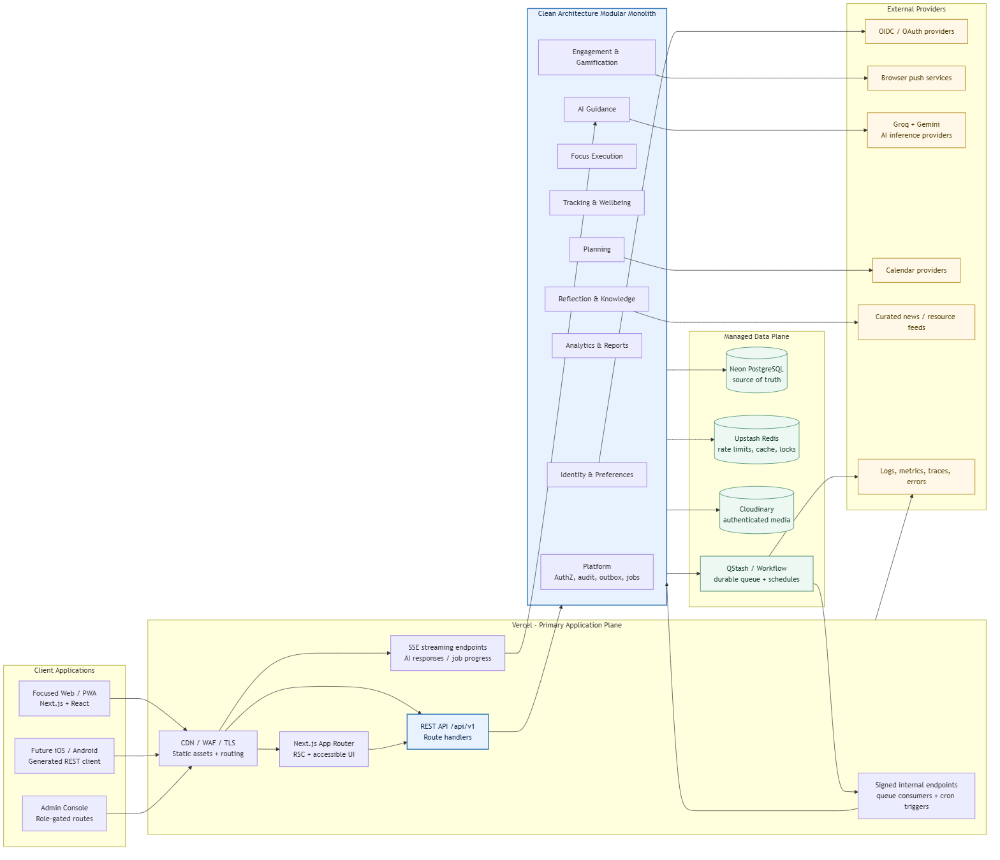
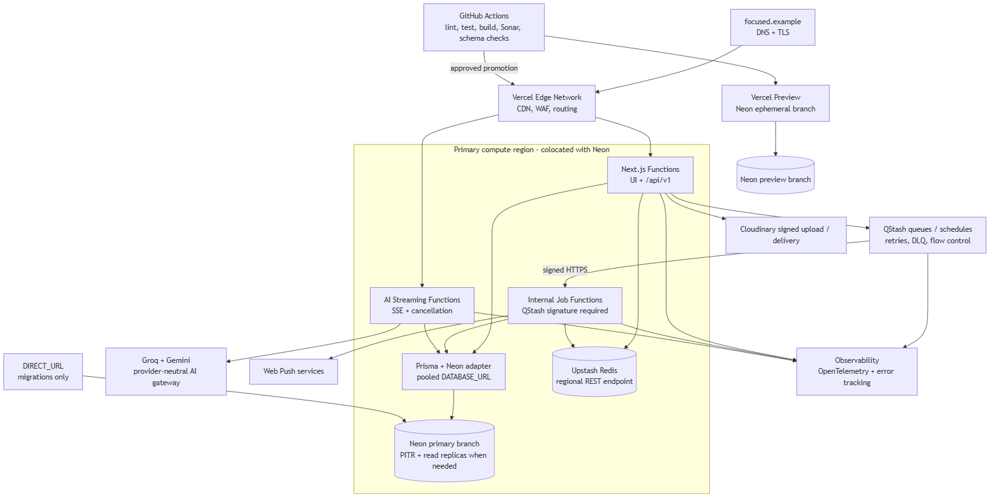
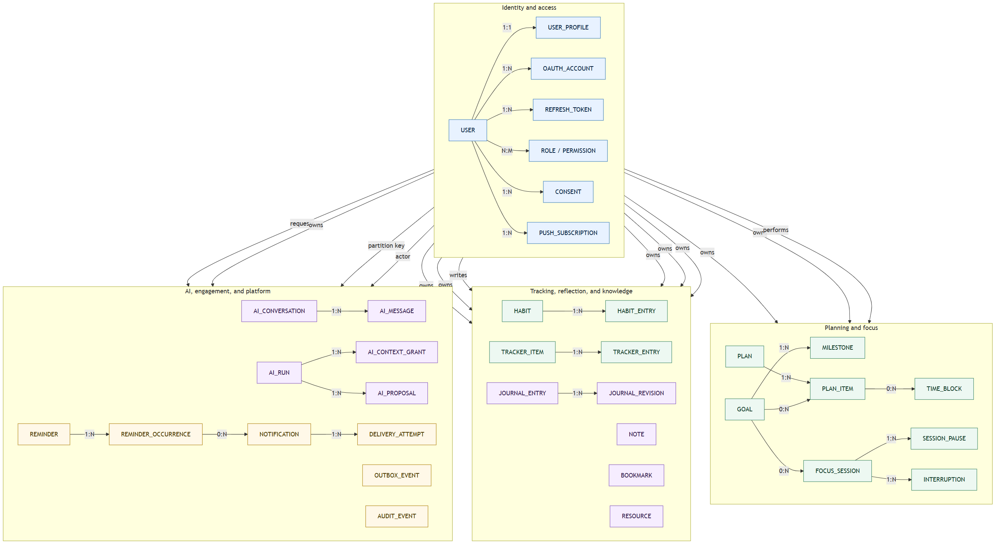
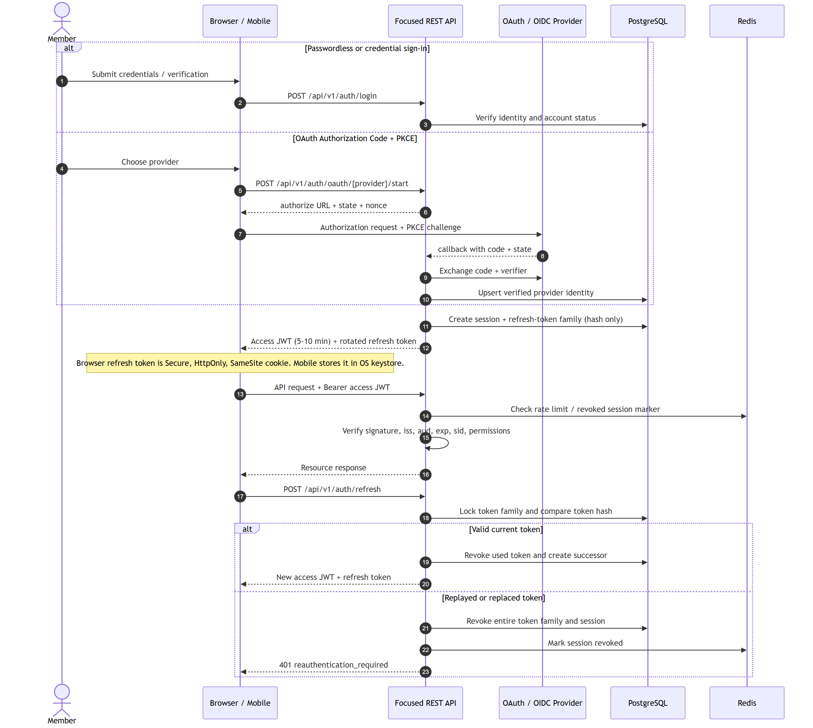
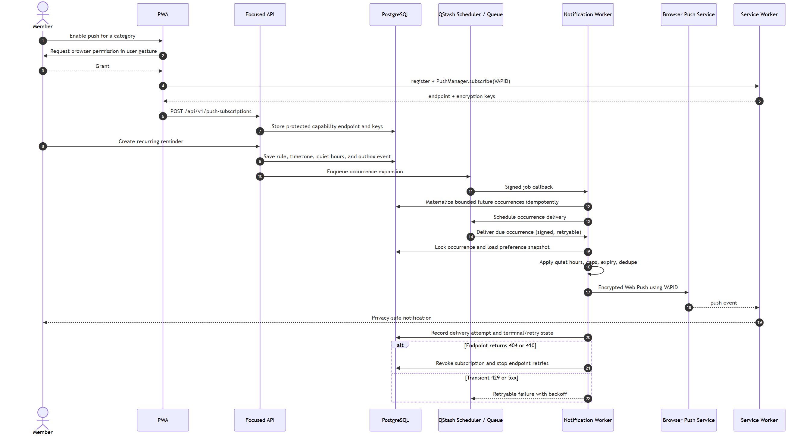
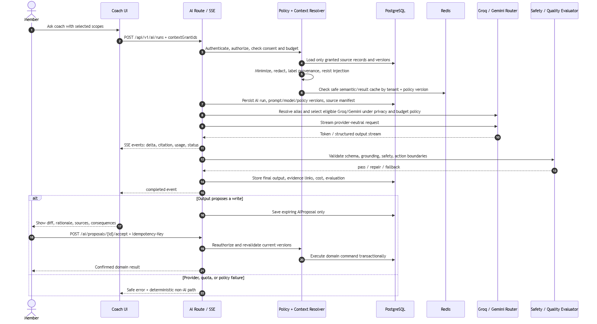
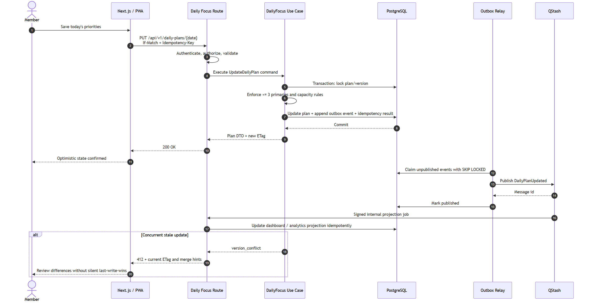

# Document Control

| Field            | Value                                           |
| ---------------- | ----------------------------------------------- |
| Document         | Focused Production Architecture Specification   |
| Version          | 1.1                                             |
| Status           | Architecture baseline for implementation        |
| Date             | 31 July 2026                                    |
| Related baseline | Focused Software Requirements Specification 1.0 |
| Decision owner   | Architecture Review Board / Product Engineering |
| Review cadence   | Every major release or material platform change |

# 1. Executive Architecture Decision

Focused will begin as a **Clean Architecture modular monolith implemented in TypeScript on Next.js**, deployed on Vercel, with a versioned REST API that is independent of the web UI. PostgreSQL on Neon is the transactional source of truth. Prisma is the persistence adapter. Durable background work is dispatched through QStash/Workflow; Upstash Redis is used only for ephemeral coordination, rate limiting, hot caches, and revocation acceleration. Cloudinary stores media assets through signed uploads and authenticated delivery. The web application is an installable PWA using React, Tailwind CSS, and shadcn/ui.

The architecture deliberately avoids both extremes: it does not begin with dozens of microservices, and it does not place domain logic inside React components or Next.js route files. Every feature is a module with domain, application, infrastructure, transport, UI, and test boundaries. The same application use cases serve web, future mobile, background jobs, and administrative clients.

**Primary backend choice: Next.js Route Handlers on the Node.js runtime.** FastAPI is reserved as an extraction option for a later Python-owned AI/ML service when there is evidence that model hosting, Python-native data processing, independent scaling, or a separate team boundary justifies it.

**Initial AI providers: Groq and Gemini behind a provider-neutral gateway.** Groq is preferred for latency-sensitive text interactions and transcription; Gemini is preferred for approved long-context and multimodal work. Free quotas support development and controlled MVP traffic, but sensitive member data is never sent to Gemini's unpaid service and production capacity cannot depend on either provider's free tier.

**Production caveat.** Vercel Functions are request-driven compute, not a durable worker runtime. Reminder expansion, notification delivery, exports, report generation, ingestion, AI evaluation, and outbox relay work must therefore be represented as durable jobs and invoked through signed queue callbacks. A response timeout must never become the job's state machine.

{ width=100% }

# 2. Architecture Goals and Quality Attribute Drivers

## 2.1 Goals

1. Preserve the FocusOS product loop: direction, planning, focus, observation, reflection, and adaptation.
2. Keep all business rules reusable by web, PWA, future mobile, administrative, scheduled, and AI-assisted clients.
3. Provide strong privacy isolation for journals, life vision, mood, sleep, faith, health, and AI conversations.
4. Scale read traffic, write traffic, scheduled reminders, analytics, and AI workloads independently when evidence demands it.
5. Support safe offline operation for local drafts and explicitly idempotent mutations without silent conflict loss.
6. Make every privileged or automated action observable, attributable, bounded, and reversible where the domain permits.
7. Keep the first production system understandable by a small team while preserving extraction seams for millions of users.

## 2.2 Quality Attribute Priorities

| Priority | Attribute                   | Architectural response                                                                                                                                                                      |
| -------- | --------------------------- | ------------------------------------------------------------------------------------------------------------------------------------------------------------------------------------------- |
| 1        | Security and privacy        | Short-lived access tokens, refresh rotation, deny-by-default RBAC plus ownership checks, encrypted transport/storage, context grants, audit events, secret isolation, content minimization. |
| 2        | Correctness and trust       | PostgreSQL transactions, domain invariants, optimistic concurrency, idempotency records, outbox/inbox patterns, immutable ledgers, explicit time-zone rules.                                |
| 3        | Availability and resilience | Stateless functions, durable queues, retries with backoff, dead-letter handling, graceful provider fallbacks, cached read models, regional colocation.                                      |
| 4        | Usability and accessibility | Server-rendered critical paths, progressive enhancement, WCAG 2.2 AA, predictable UI states, reduced motion, keyboard parity, semantic status messages.                                     |
| 5        | Performance                 | RSC, code splitting, bounded queries, cursor pagination, indexes, pooled database access, cache-aside only for proven hot reads, CDN delivery.                                              |
| 6        | Maintainability             | Feature modules, dependency rule, generated contracts, architecture tests, ADRs, strict TypeScript, Sonar quality gates, migration discipline.                                              |
| 7        | Evolvability                | Versioned REST, provider ports, event contracts, outbox, projection tables, extraction criteria, mobile-neutral authentication and DTOs.                                                    |

## 2.3 Non-goals

- No microservice per feature in the initial system.
- No direct database access from React components, Server Components, or route handlers.
- No unbounded autonomous AI writes.
- No Redis as the authoritative store for user progress, timers, reminders, XP, or authorization.
- No public-by-default Cloudinary assets for private member content.
- No timer correctness based on a continuously running browser tab or server process.
- No event sourcing of the entire application. Append-only ledgers are used only where auditability demands them.

# 3. Backend Selection: Next.js API vs FastAPI

## 3.1 Decision Matrix

| Criterion              | Next.js Route Handlers                                                                                   | FastAPI                                                                                                       | Decision impact             |
| ---------------------- | -------------------------------------------------------------------------------------------------------- | ------------------------------------------------------------------------------------------------------------- | --------------------------- |
| Fit with Prisma        | Native TypeScript/Node integration and shared generated types                                            | Prisma Client Python is not the selected ORM; a separate Node data service or different ORM would be required | Strongly favors Next.js     |
| Vercel operations      | One project, preview deployment, environment, routing, observability, and rollback surface               | Supported as Python functions, but introduces a second runtime and packaging path                             | Favors Next.js              |
| REST and OpenAPI       | Route handlers need deliberate schema generation and architecture discipline                             | Excellent native OpenAPI and validation experience                                                            | Favors FastAPI in isolation |
| AI ecosystem           | Excellent for calling hosted model APIs and streaming SSE                                                | Stronger for Python ML libraries, local inference, notebooks, and data science                                | Conditional                 |
| Shared contracts       | Zod schemas and generated API clients can be shared across TypeScript packages                           | Requires cross-language OpenAPI generation and duplicate domain representations                               | Favors Next.js now          |
| Background work        | Neither request runtime should be treated as a durable queue; both need external orchestration on Vercel | Same                                                                                                          | Neutral                     |
| Team cognitive load    | One language and deployment plane                                                                        | Two languages, dependency graphs, pipelines, observability conventions, and security patch streams            | Favors Next.js              |
| Independent AI scaling | Requires extracting a service when needed                                                                | Natural fit for an independently deployed Python service                                                      | Favors FastAPI later        |

## 3.2 Recommendation

Use **Next.js Route Handlers** for the Focused public REST API and internal queue consumers. This is the best fit because the selected ORM is Prisma, the deployment target is Vercel, the frontend is TypeScript, and the first architecture should optimize for coherence. Route handlers support standard HTTP methods and use the Web Request/Response APIs; they are a transport adapter, not the place for domain logic.

Use the **Node.js runtime**, not Edge, for Prisma transactions, Web Push libraries, crypto operations, and provider SDK compatibility. Edge can remain an option for middleware that does not access the database, such as coarse routing or static personalization, but authorization decisions still happen at the trusted application boundary.

Introduce FastAPI only when all of these are true:

1. A bounded Python-owned capability exists, such as local model inference, large document processing, or specialized recommendation training.
2. Its API/event contract and data ownership are explicit.
3. Independent scaling or release cadence has measurable value.
4. The team can operate a second runtime, container platform, observability pipeline, vulnerability stream, and on-call path.
5. The service never bypasses Focused authorization or reads unrestricted production tables.

The extracted service receives scoped work through an authenticated queue/API, returns results through a versioned contract, and owns either a dedicated schema/database or no durable source-of-truth state. It does not become a privileged backdoor to member data.

# 4. Architecture Style and Principles

## 4.1 Modular Monolith with Extraction Seams

The deployable application is one Next.js project, but the codebase is separated into domain modules. Each module controls its aggregate boundaries, commands, queries, policies, repository ports, transport mapping, event definitions, and UI feature slice. Cross-module writes happen through application use cases or domain events, never by importing another module's Prisma repository.

Extraction is considered when a module has a materially different scale profile, reliability boundary, data classification, regulatory boundary, team ownership, or runtime need. High traffic alone is not sufficient: read replicas, projections, queues, and caching are cheaper than a premature network boundary.

## 4.2 Clean Architecture Dependency Rule

- **Domain:** entities, value objects, policies, calculations, and state machines. It imports no Next.js, Prisma, Redis, Cloudinary, queue, or model-provider code.
- **Application:** commands, queries, authorization orchestration, transactions, idempotency, and domain-event publication. It depends on domain types and ports.
- **Infrastructure:** Prisma repositories, Redis adapters, QStash publishers, OAuth, Cloudinary, Web Push, AI, calendar, and news providers.
- **Transport:** Next.js route handlers, request/response mapping, SSE, webhook verification, and generated OpenAPI registration.
- **Presentation:** App Router pages/layouts, Server Components, Client Components, shadcn/ui compositions, form schemas, and accessible interaction states.

## 4.3 Domain Boundaries

| Module                      | Owns source-of-truth state                                                                                               | Publishes representative events                                 |
| --------------------------- | ------------------------------------------------------------------------------------------------------------------------ | --------------------------------------------------------------- |
| Identity and Preferences    | users, provider identities, sessions, refresh families, roles, consents, locale, accessibility, notification preferences | UserRegistered, SessionRevoked, ConsentChanged, TimeZoneChanged |
| Planning                    | life vision, goals, milestones, plans, plan items, calendar connections/events, time blocks, schedule proposals          | GoalChanged, PlanClosed, TimeBlockChanged                       |
| Focus Execution             | deep-work/Pomodoro sessions, pauses, interruptions, outcomes                                                             | FocusSessionStarted, FocusSessionCompleted, InterruptionLogged  |
| Tracking and Wellbeing      | habits and typed tracker items/entries; learning, reading, coding, faith, workout, sleep, mood specialization            | TrackerEntryRecorded, HabitPaused, EvidenceAdded                |
| Reflection and Knowledge    | journal/revisions, reflections, notes, bookmarks, resources, collections, search documents                               | PrivateDocumentChanged, ResourceSaved                           |
| AI Guidance                 | conversations, messages, runs, context grants, evidence manifests, evaluations, proposals, feedback                      | AIRunCompleted, AIProposalAccepted                              |
| Analytics and Reports       | metric definitions, projections, snapshots, report/export jobs                                                           | ProjectionUpdated, ExportReady                                  |
| Engagement and Gamification | reminders, occurrences, notifications, deliveries, XP ledger, achievements, levels, streaks, challenges                  | ReminderDue, DeliveryFinalized, XPAwarded                       |
| Administration and Platform | feature flags, policy configuration, audit, idempotency, webhook inbox, outbox, job metadata                             | PrivilegedActionRecorded, FeatureFlagChanged                    |

## 4.4 Transaction and Event Rules

1. A command updates one aggregate boundary in one PostgreSQL transaction whenever possible.
2. The transaction also writes an `OutboxEvent`; publishing never happens before commit.
3. The relay claims rows with bounded batches and `FOR UPDATE SKIP LOCKED`, publishes to the durable queue, and records publication.
4. Consumers use an inbox/deduplication key and are at-least-once safe.
5. Cross-module projections are eventually consistent and expose an `asOf` timestamp when user meaning could change.
6. Business-critical ledgers (XP, delivery attempts, privileged audit) are append-only; corrections use compensating entries.
7. No distributed transaction is introduced. External effects use state machines, retries, and compensation.

# 5. System and Deployment Architecture

## 5.1 Runtime Topology

{ width=100% }

Vercel serves static assets and cached public pages at the edge and executes dynamic Node.js functions in the region closest to the primary Neon compute. Database and compute must be colocated; cross-region database chatter is avoided. A second region is introduced only with an explicit read/write strategy and tested failover behavior.

The application uses two database URLs:

- `DATABASE_URL`: Neon pooled endpoint through `@prisma/adapter-neon` for runtime queries.
- `DIRECT_URL`: non-pooled endpoint used only by Prisma Migrate and approved operational tooling.

Preview deployments receive isolated Neon branches and non-production providers. Production migrations run once in a protected CI job before application promotion, never from function startup.

## 5.2 Synchronous and Asynchronous Work

**Synchronous requests** must finish within a short product latency budget: authentication, CRUD, queries, timer transitions, preference changes, proposal acceptance, and queue submission.

**Asynchronous jobs** include reminder occurrence expansion, notification delivery, webhook processing, report/export generation, search indexing, news ingestion, calendar reconciliation, media cleanup, analytics projection, AI evaluations, and future agent runs. The request creates a job record and returns `202 Accepted` with a status URL when completion is not immediate.

QStash/Workflow provides durable delivery, retries, schedules, flow control, and dead-letter handling. Every callback verifies the current/next signing keys, validates audience/body, checks the job idempotency key, and uses a short database transaction. Queue messages contain identifiers and versions, not private document bodies or bearer credentials.

## 5.3 Provider Boundaries

External providers are accessed through ports with explicit timeout, retry, circuit-breaker, privacy, and fallback policies. Provider response objects never leak into domain models or public DTOs. Each adapter normalizes errors to stable internal categories: unavailable, throttled, invalid request, unauthorized, rejected content, timeout, and unknown.

# 6. Repository and Folder Structure

The recommended repository is a pnpm/Turborepo workspace. It separates deployable applications from reusable packages while keeping one atomic repository and one architecture rule set.

```text
focused/
|-- apps/
|   |-- web/                              # Vercel deployable Next.js application
|   |   |-- src/
|   |   |   |-- app/
|   |   |   |   |-- (marketing)/          # public SEO routes
|   |   |   |   |-- (auth)/               # login, OAuth callback, recovery
|   |   |   |   |-- (app)/                # authenticated product shell
|   |   |   |   |-- admin/                # server-gated admin routes
|   |   |   |   |-- api/v1/               # public REST transport adapters
|   |   |   |   |-- api/internal/         # signed QStash/provider callbacks
|   |   |   |   `-- manifest.ts            # PWA metadata
|   |   |   |-- features/                  # UI feature slices only
|   |   |   |   |-- daily-focus/
|   |   |   |   |-- focus-timer/
|   |   |   |   |-- goals/
|   |   |   |   `-- ...
|   |   |   |-- components/
|   |   |   |   |-- ui/                    # shadcn primitives
|   |   |   |   `-- shared/                # composed reusable components
|   |   |   |-- hooks/
|   |   |   |-- lib/                       # web-only adapters, API client
|   |   |   |-- providers/                 # Query, theme, i18n, telemetry
|   |   |   `-- service-worker/            # offline and Web Push handlers
|   |   `-- tests/                          # browser/e2e and a11y fixtures
|   `-- storybook/                          # optional design-system deployable
|-- packages/
|   |-- modules/
|   |   |-- identity/
|   |   |   |-- domain/
|   |   |   |-- application/
|   |   |   |-- infrastructure/
|   |   |   |-- transport/
|   |   |   `-- tests/
|   |   |-- planning/
|   |   |-- focus/
|   |   |-- tracking/
|   |   |-- reflection-knowledge/
|   |   |-- ai-guidance/                   # Groq/Gemini adapters stay in infrastructure
|   |   |-- analytics-reports/
|   |   |-- engagement-gamification/
|   |   `-- administration/
|   |-- platform/
|   |   |-- auth/                           # JWT, OAuth, session context
|   |   |-- authorization/                  # RBAC + ownership policies
|   |   |-- database/                       # Prisma client and transaction port
|   |   |-- events/                         # outbox, inbox, contracts
|   |   |-- jobs/                           # QStash publisher/verification
|   |   |-- cache/                          # Redis interfaces and policies
|   |   |-- observability/                  # logging, metrics, tracing
|   |   |-- security/                       # crypto, redaction, rate limits
|   |   `-- time/                           # Instant, LocalDate, IANA time zone
|   |-- contracts/                          # Zod DTOs, OpenAPI registry, events
|   |-- api-client/                         # generated TypeScript client
|   |-- config/                             # typed environment configuration
|   |-- eslint-config/
|   |-- typescript-config/
|   `-- test-kit/
|-- prisma/
|   |-- schema.prisma
|   |-- migrations/
|   `-- seed.ts                             # reference data only
|-- api/
|   |-- openapi.yaml
|   `-- changelog/
|-- docs/
|   |-- architecture/
|   |   |-- diagrams/
|   |   |-- adr/
|   |   `-- runbooks/
|   `-- ...
|-- scripts/                                # migration, contract, and release tooling
|-- .github/workflows/
|-- turbo.json
|-- pnpm-workspace.yaml
`-- package.json
```

## 6.1 Import Rules

- `domain` imports only domain/common value types.
- `application` may import domain and port interfaces.
- `infrastructure` implements ports and may import Prisma/provider SDKs.
- `transport` maps HTTP/queue input to application commands and maps results to DTOs.
- `apps/web/features` consumes the generated public API client; it never imports Prisma repositories.
- A module may consume another module's public application facade or event contract, not internal folders.
- ESLint boundaries and dependency-cruiser/architecture tests fail CI on violations.

# 7. Frontend Architecture and State Management

## 7.1 Rendering Strategy

- Use React Server Components for page shells, metadata, authenticated initial reads, and stable content.
- Use Client Components only for interactive islands: timers, drag/drop schedules, forms, optimistic mutations, charts, offline drafts, and push permission UI.
- Public marketing/help/news pages use static generation or controlled revalidation and complete metadata, canonical URLs, structured data, sitemap, and robots rules.
- Private application routes are `noindex`; cached server output must never be shared across users.
- shadcn/ui primitives remain locally owned and are wrapped into accessible product components rather than duplicated feature markup.

## 7.2 Recommended State Model

There is no single global state library. State is assigned by ownership:

| State type                      | Recommended owner                                                                | Examples                                                    |
| ------------------------------- | -------------------------------------------------------------------------------- | ----------------------------------------------------------- |
| Server state                    | TanStack Query for interactive client views; RSC/fetch for server-rendered reads | goals, plans, habits, notifications, analytics              |
| URL state                       | Next.js search params and typed parsers                                          | date, tab, filters, sort, cursor-compatible view state      |
| Form state                      | React Hook Form plus Zod contract schemas                                        | goal editor, onboarding, reminder settings                  |
| Local component state           | `useState` / `useReducer`                                                        | disclosure, selected row, modal step                        |
| Cross-component ephemeral state | Zustand, narrowly scoped by feature                                              | active timer UI, offline sync queue status, command palette |
| Durable offline drafts          | IndexedDB through a repository adapter                                           | journal/note draft, daily-plan mutation envelope            |
| Authentication                  | Server session context plus in-memory access token on clients                    | actor, permissions, session expiry                          |

TanStack Query is the default for client-side server-state synchronization, cache invalidation, retries, and optimistic mutations. Zustand is **not** a database mirror and must not hold domain collections globally. Redux Toolkit is unnecessary initially; reconsider it only if offline event coordination becomes complex enough to justify explicit reducers, middleware, and replay tooling.

## 7.3 Timer Correctness

The timer stores authoritative timestamps and transitions, not decrementing counters. The UI derives remaining time from `startedAt`, accumulated pause duration, planned duration, and current monotonic/browser time. Sleep, refresh, background throttling, or reconnect triggers reconciliation with the server. Only one active focus session per user is enforced by a partial unique database index and transaction.

## 7.4 Offline Strategy

Use a service worker to precache the application shell and cache explicitly safe reads. Private API responses are never placed in a shared CDN cache. IndexedDB stores encrypted-at-rest-where-supported local drafts and mutation envelopes with `clientMutationId`, base version, created time, and actor scope. Sync follows these rules:

1. Queue only approved, bounded, idempotent mutations.
2. Replay in order per aggregate, not globally.
3. Use `If-Match`/version checks and surface conflicts for human resolution.
4. Never queue privileged/admin, OAuth, consent, destructive account, or AI proposal acceptance actions offline.
5. Expire and purge local private data on logout, session revocation, or user request.

# 8. API Architecture

## 8.1 REST Contract

The public base path is `/api/v1`. It is the contract for web and future mobile clients. Route handlers call the same application layer; server-side UI rendering is not a privileged bypass. The canonical OpenAPI 3.1 contract lives in `api/openapi.yaml`, is linted in CI, and generates clients and documentation.

**Terminology:** OpenAPI is retained because it is the vendor-neutral, free specification describing Focused's own REST endpoints. It is not OpenAI and it is not an AI model provider. Groq and Gemini are the initial AI inference providers behind the separate provider-neutral AI gateway.

### Conventions

- JSON over TLS; UTF-8; camelCase public fields; opaque UUID/UUIDv7 identifiers.
- Resource nouns and standard methods. Commands that do not map to CRUD use subordinate action resources, such as `POST /focus-sessions/{id}/completion`.
- UTC RFC 3339 instants plus explicit IANA time zone and local date where user meaning depends on locality.
- Cursor pagination for unbounded collections: `page[after]`, `page[limit]`, with a stable indexed sort.
- `ETag` and `If-Match` for mutable aggregates; stale writes return `412 Precondition Failed`.
- `Idempotency-Key` for create, command, import, export, and external-effect requests. Keys are scoped to actor plus route and retained for the retry window.
- `202 Accepted` plus `Location` for asynchronous jobs.
- RFC 9457 Problem Details with `type`, `title`, `status`, `detail`, `instance`, `code`, `correlationId`, and `errors`.
- Additive changes are preferred within a version. Breaking changes require a new major path, migration guide, deprecation/sunset headers, and usage telemetry.
- Request/response DTOs are not Prisma models and do not expose internal foreign keys, token hashes, provider payloads, or deleted private content.

## 8.2 Status and Error Semantics

| Situation                      |                        Status | Contract                                           |
| ------------------------------ | ----------------------------: | -------------------------------------------------- |
| Successful read/update         |                           200 | resource plus metadata/ETag                        |
| Successful create              |                           201 | resource and `Location`                            |
| Accepted durable job           |                           202 | job resource and status URL                        |
| Successful no-body delete      |                           204 | no response body                                   |
| Validation/domain rule         |                    400 or 422 | stable code plus field/action errors               |
| Missing/invalid authentication |                           401 | `WWW-Authenticate`; no account enumeration         |
| Authenticated but forbidden    | 403 or privacy-preserving 404 | stable safe message                                |
| Resource absent                |                           404 | no existence leakage                               |
| Duplicate natural key/state    |                           409 | conflict code and safe resolution                  |
| Stale aggregate version        |                           412 | current ETag and merge hints where safe            |
| Rate limited                   |                           429 | `Retry-After`; limit category, no sensitive detail |
| Dependency unavailable         |                           503 | retryability and correlation ID                    |

## 8.3 Endpoint Catalog

The following is the bounded architecture surface. Each collection supports only the methods documented in OpenAPI; the table is not permission by implication.

| Domain                   | Resources                                                                                                                                                                                                                                                                                        |
| ------------------------ | ------------------------------------------------------------------------------------------------------------------------------------------------------------------------------------------------------------------------------------------------------------------------------------------------ |
| Identity                 | `/auth/*`, `/users/me/profile`, `/users/me/sessions`, `/users/me/consents`, `/users/me/settings`, `/users/me/integrations`, `/users/me/locale`, `/users/me/accessibility`, `/onboarding`, `/locales`                                                                                             |
| Dashboard                | `/dashboard`, `/dashboard/widgets`                                                                                                                                                                                                                                                               |
| Daily focus and timers   | `/daily-plans/{date}`, `/daily-plans/{date}/priorities`, `/daily-plans/{date}/completion`, `/focus-sessions`, `/focus-sessions/{id}/pauses`, `/focus-sessions/{id}/resumption`, `/focus-sessions/{id}/completion`, `/focus-sessions/{id}/interruptions`, `/pomodoro/presets`, `/pomodoro/cycles` |
| Planning                 | `/schedule/proposals`, `/schedule/time-blocks`, `/goals`, `/goals/{id}/milestones`, `/goals/{id}/check-ins`, `/life-vision`, `/life-vision/revisions`, `/life-vision/areas`, `/weekly-plans/{week}`, `/monthly-plans/{month}`, `/yearly-plans/{year}`                                            |
| Calendar                 | `/calendars`, `/calendar/events`, `/calendar/connections`, `/calendar/free-busy`, `/calendar/sync`                                                                                                                                                                                               |
| Habits and learning      | `/habits`, `/habits/{id}/entries`, `/learning/paths`, `/learning/items`, `/learning/sessions`, `/learning/evidence`, `/programming/skills`, `/programming/projects`, `/programming/logs`                                                                                                         |
| Reading and coding       | `/coding-practice/problems`, `/coding-practice/attempts`, `/coding-practice/imports`, `/reading/items`, `/reading/items/{id}/progress`, `/reading/sessions`                                                                                                                                      |
| Faith and wellbeing      | `/quran/plans`, `/quran/progress`, `/quran/reviews`, `/prayer/preferences`, `/prayer/times`, `/prayer/logs`, `/workouts/plans`, `/workouts/sessions`, `/workouts/exercises`, `/sleep/entries`, `/sleep/imports`, `/sleep/trends`, `/moods`, `/mood-scales`, `/moods/trends`                      |
| Reflection and knowledge | `/journal/entries`, `/journal/entries/{id}/revisions`, `/journal/prompts`, `/reflections`, `/notes`, `/notes/{id}/revisions`, `/bookmarks`, `/resources`, `/knowledge/items`, `/knowledge/collections`, `/knowledge/search`, `/search`, `/search/suggestions`                                    |
| News and recommendations | `/news`, `/news/sources`, `/news/preferences`, `/learning/recommendations`, `/learning/recommendations/{id}/feedback`                                                                                                                                                                            |
| AI guidance              | `/ai/runs`, `/ai/coach/conversations`, `/ai/coach/messages`, `/ai/mentor/plans`, `/ai/mentor/sessions`, `/ai/reviews/daily/{date}`, `/ai/reviews/weekly/{week}`, `/ai/reviews/monthly/{month}`, `/ai/suggestions`, `/ai/proposals/{id}/decision`, `/ai/reminder-proposals`                       |
| Analytics and reports    | `/analytics/focus`, `/analytics/distractions`, `/distractions`, `/reports`, `/reports/{id}/generation`, `/reports/{id}/snapshots`, `/exports`                                                                                                                                                    |
| Gamification             | `/achievements`, `/achievements/awards`, `/gamification/xp`, `/gamification/xp/ledger`, `/gamification/levels`, `/users/me/level`, `/streaks`, `/gamification/preferences`, `/challenges`, `/challenges/{id}/enrollments`                                                                        |
| Engagement               | `/notifications`, `/notification-preferences`, `/push-subscriptions`, `/reminders`, `/reminders/{id}/occurrences`, `/reminders/{id}/snooze`                                                                                                                                                      |
| Administration           | `/admin/users`, `/admin/roles`, `/admin/content`, `/admin/feature-flags`, `/admin/audit`, `/admin/health`, `/admin/translations`, `/admin/news-sources`, `/admin/resource-catalog`, `/admin/gamification-rules`                                                                                  |
| Future agents            | `/agents`, `/agents/{id}/runs`, `/agent-runs/{id}/approvals`, `/agent-tools`                                                                                                                                                                                                                     |

## 8.4 Read Models and Graph Shape

REST resources remain domain-oriented, but dashboard and review screens need composed data. Use explicit read-model endpoints such as `/dashboard` and `/ai/reviews/weekly/{week}` rather than causing a mobile client to make dozens of requests. These projections are denormalized tables or bounded queries, carry `asOf`, and are rebuilt from authoritative data. Avoid a generic GraphQL layer until client evidence shows that fixed REST projections are insufficient.

# 9. Database Architecture

## 9.1 PostgreSQL and Prisma

Neon PostgreSQL is the authoritative transactional store. Prisma is an infrastructure adapter, not the domain model. Repositories map between Prisma records and domain aggregates. The application uses pooled runtime connections and direct migration connections. Long interactive transactions, session-level locks, `LISTEN`, and other session-state features are avoided on transaction pooling.

The complete implementation baseline is provided in `prisma/schema.prisma`. It uses:

- UUID primary keys and UTC `timestamptz` values.
- `createdAt`, `updatedAt`, and `version` on mutable aggregates.
- explicit `userId` on member-owned tables for simple authorization predicates and partition/index options.
- soft deletion only where recovery, audit, or synchronization requires it; otherwise controlled hard deletion.
- JSON only for bounded, versioned metadata, provider payload fragments, and snapshots; frequently filtered domain fields remain typed columns.
- composite unique constraints for idempotency, deduplication, natural periods, and ledgers.
- append-only outbox, audit, XP, and delivery-attempt records.

## 9.2 Schema Conventions

| Concern                | Rule                                                                                                          |
| ---------------------- | ------------------------------------------------------------------------------------------------------------- |
| Ownership              | Every private row is reachable from one `userId`; repositories require actor scope.                           |
| Optimistic concurrency | Mutable aggregate roots have integer `version`; updates include the expected version.                         |
| Time                   | Instants are UTC; plans/reminders also store local date/time and IANA time zone when semantically required.   |
| Money/cost             | AI and provider cost uses integer micros, never floating point.                                               |
| Metrics                | Duration uses integer seconds/milliseconds; quantities use `Decimal` with declared units.                     |
| Private text           | Classified at the field/model level; excluded from logs, analytics events, and AI unless granted.             |
| Deletion               | Deletion jobs traverse an explicit registry; tombstones synchronize clients without retaining private bodies. |
| Search                 | PostgreSQL full-text/trigram indexes first; external search is introduced only at measured scale.             |
| Migrations             | Expand/contract, backward-compatible releases, checksums, lock-time budget, tested rollback/roll-forward.     |

## 9.3 ER Overview

{ width=100% }

The ER diagram is intentionally an aggregate overview. Specialized tracker entities share `TrackerItem`/`TrackerEntry` for common list, timeline, search, import, and analytics behavior, while structured details are stored in typed extension tables or versioned metadata with schema validation. Critical domains such as habits, focus sessions, plans, reminders, AI runs, and ledgers retain dedicated tables and invariants.

## 9.4 Index and Partition Strategy

Initial indexes follow actual access paths:

- member timelines: `(user_id, occurred_at DESC, id DESC)`;
- period uniqueness: `(user_id, plan_type, period_start)`;
- active timer: partial unique index on `focus_sessions(user_id) WHERE status IN ('RUNNING','PAUSED')`;
- due reminders: `(status, scheduled_for)` with a partial predicate for pending occurrences;
- notification dedupe: unique `(user_id, deduplication_key)`;
- outbox relay: partial `(occurred_at, id) WHERE published_at IS NULL`;
- refresh token lookup: unique hash plus family/session indexes;
- journal/note search: tenant-filtered full-text vector and trigram indexes where enabled.

Do not partition early. Begin partitioning append-heavy tables—`audit_events`, `metric_events`, `delivery_attempts`, `outbox_events`, and possibly `tracker_entries`—by monthly time range only when vacuum, index size, retention deletion, or query evidence requires it. Partition keys must remain compatible with user deletion and tenant predicates.

# 10. Authentication and Authorization

## 10.1 Token Model

- Access token: signed JWT, 5-10 minute lifetime, asymmetric EdDSA or RS256, claims `iss`, `aud`, `sub`, `sid`, `jti`, `iat`, `nbf`, `exp`, role/permission version. Do not put profile or private content in claims.
- Refresh token: 256-bit opaque random value, rotated on every use. The database stores only a SHA-256 hash because the token has high entropy. Tokens belong to a family and session.
- Browser storage: refresh token in `Secure`, `HttpOnly`, `SameSite=Lax` cookie scoped to the refresh path; access token held in memory. Never use localStorage for refresh tokens.
- Native storage: refresh token in OS secure storage; access token in memory. OAuth uses Authorization Code with PKCE and claimed HTTPS redirect/app-link patterns.
- Replay detection: presentation of a previously replaced refresh token revokes the entire family and session and produces a security event.
- Key rotation: signing keys have `kid`; current and previous verification keys overlap during controlled rotation. Secrets live only in protected environment/KMS facilities.

{ width=100% }

## 10.2 OAuth Flow

Use OIDC where available and OAuth Authorization Code with PKCE, `state`, and `nonce`. Provider identities are keyed by `(provider, providerSubject)`, never email alone. Linking a provider to an existing account requires an authenticated session or explicit verified-email confirmation. Callback errors do not disclose whether an email already exists.

## 10.3 Authorization

Authorization combines:

1. **RBAC:** member, support administrator, content curator, platform administrator, and auditor roles map to permissions.
2. **Resource ownership:** member-private resources require `resource.userId == actor.userId`.
3. **Attribute/policy checks:** consent, data category, account status, feature flag, plan tier if introduced, and step-up status.
4. **Capability grants:** AI and future agents receive short-lived run-scoped grants, not human refresh tokens.

Every application use case declares its permission and ownership policy. Route hiding is only presentation. Support and administrators cannot routinely read journal, mood, faith, health, life-vision, or AI-conversation bodies. Privileged mutations require reason codes and immutable audit events; dangerous changes require recent MFA/step-up and, where configured, dual control.

## 10.4 CSRF, XSS, and Session Controls

Cookie-authenticated refresh, logout, and OAuth-link endpoints require origin verification and CSRF tokens. Mutating APIs normally use the bearer access token. Apply a strict CSP with nonces, Trusted Types where feasible, output encoding, sanitized rich text, dependency pinning, and no inline secrets. Sessions expose device metadata, last activity, and revoke actions; password/security changes revoke other sessions according to policy.

# 11. Notification and Reminder Architecture

## 11.1 Web Push

The PWA registers a service worker and subscribes only after an explicit user gesture. The subscription endpoint and encryption keys are capability secrets and are protected accordingly. VAPID keys identify the Focused application server. Push payloads are minimal and privacy-safe; the service worker fetches current authorized detail after the user opens the application.

{ width=100% }

## 11.2 Reminder Occurrences

Recurring rules are stored canonically with time zone, local time, recurrence rule/version, quiet hours, missed-delivery policy, and next expansion boundary. A durable job materializes a bounded window of occurrences, typically 30-45 days, and re-expands after edits or time-zone changes. Each occurrence has a deterministic key derived from reminder, rule version, and local occurrence.

Delivery is at least once; user-visible notification creation is effectively once through unique deduplication keys. A worker rechecks current preferences, category caps, quiet hours, account status, subscription status, and expiry immediately before sending. `404`/`410` removes an endpoint, `429`/`5xx` retries with bounded exponential backoff and jitter, and permanent payload errors fail without loops.

## 11.3 Notification Data Model

- `Reminder`: user intent and recurrence policy.
- `ReminderOccurrence`: one scheduled semantic occurrence.
- `Notification`: channel-neutral member notification and in-app inbox item.
- `DeliveryAttempt`: append-only provider attempt with redacted diagnostics.
- `PushSubscription`: protected endpoint, keys, device metadata, and revocation state.
- `NotificationPreference`: category/channel/quiet-hours policy with a versioned snapshot.

# 12. AI Architecture

## 12.1 Design Position

AI is an advisory subsystem, not a source-of-truth owner. It may summarize, explain, recommend, draft, classify, or propose. It cannot silently alter goals, plans, reminders, journal entries, calendar events, or permissions. Domain changes occur only by calling normal application commands after explicit user acceptance or a narrowly preconfigured policy.

{ width=100% }

## 12.2 AI Gateway Components

| Component          | Responsibility                                                                                             |
| ------------------ | ---------------------------------------------------------------------------------------------------------- |
| AI policy service  | consent, allowed purpose, data category, model/provider policy, age/safety constraints, budget             |
| Context resolver   | loads only explicitly granted records, versions, and date ranges; minimizes and labels provenance          |
| Prompt registry    | versioned system instructions, output schemas, safety policy, locale/tone variants                         |
| Provider router    | model capability, latency, cost, privacy, region, fallback, circuit breaker                                |
| Streaming adapter  | normalized SSE events, cancellation, heartbeat, usage tracking                                             |
| Output validator   | JSON/schema validation, citation/source checks, unsafe-action rejection, repair/fallback                   |
| Evaluation service | offline golden sets and sampled online checks for grounding, usefulness, safety, bias, and refusal quality |
| Proposal service   | expiring diff, rationale, evidence, target version, approval, idempotent execution                         |

## 12.3 Retrieval and Context

Use PostgreSQL full-text search and optionally `pgvector` for member-owned semantic retrieval. Every vector/document row carries `userId`, source type, source ID, source version, data classification, and deletion state. Retrieval always applies tenant and context-grant filters before ranking. Provider prompts contain the smallest useful excerpts, never unrestricted account dumps.

Prompt injection defense treats retrieved and user-supplied content as untrusted data, separates instructions from evidence, allowlists tools, validates tool arguments, and never allows retrieved text to expand capability grants. AI logs contain hashes/IDs and redacted operational metadata; prompt bodies follow explicit retention and data-use policy.

## 12.4 Streaming and Durability

Short coach responses stream through SSE. The client receives typed events: `run.started`, `message.delta`, `citation`, `usage`, `warning`, `run.completed`, and `run.failed`. The durable `AIRun` is created before provider invocation and finalized after validation. Long reviews and agent-like workflows run as queue-driven state machines with resumable steps and budgets.

## 12.5 Groq and Gemini Provider Strategy

The approved initial provider adapters are **Groq** and **Gemini**. Route handlers and application use cases never import either vendor SDK directly. They call a provider port that supports streaming generation, structured output, embeddings where available, safety signals, token accounting, cancellation, and normalized errors.

| Provider | Initial responsibilities                                                                                                                | Architectural rationale                                                                                            | Production constraints                                                                                                                                      |
| -------- | --------------------------------------------------------------------------------------------------------------------------------------- | ------------------------------------------------------------------------------------------------------------------ | ----------------------------------------------------------------------------------------------------------------------------------------------------------- |
| Groq     | low-latency coach chat, quick suggestions, classification/extraction, short summaries, and speech transcription when enabled            | very fast text inference, server-side API, streaming, structured/tool-capable models, and clear rate-limit headers | free-plan limits are organization-scoped and return `429` when exhausted; exact model availability and quotas are configuration, not code                   |
| Gemini   | daily/weekly/monthly reviews, longer-context reasoning, multimodal understanding, approved embeddings, and complex structured responses | strong long-context and multimodal capabilities with a free developer tier for evaluation and small projects       | unpaid usage is not approved for sensitive, confidential, or personal Focused content; production capacity and privacy requirements may require a paid tier |

Routing uses stable internal capability aliases rather than vendor model IDs:

- `fast_text` normally selects Groq for interactive coach responses.
- `deep_review` normally selects Gemini for weekly/monthly synthesis.
- `multimodal` selects Gemini only when the member grants the required media scope.
- `transcription` selects a Groq speech model when enabled for the tenant and locale.
- `embedding` selects an approved Gemini embedding model only for permitted data classes; PostgreSQL full-text search remains the zero-provider fallback.

The router resolves an alias to a versioned provider/model configuration at run time. `GROQ_API_KEY` and `GEMINI_API_KEY` are server-only secrets; they are never exposed through `NEXT_PUBLIC_*`, browser bundles, logs, or client requests. The database records the capability alias, resolved provider/model, policy version, token usage, latency, and cost for every run. A client cannot select a provider directly or bypass privacy, safety, and budget policy.

Fallback is capability- and policy-aware. A request may move from Groq to Gemini, or the reverse, only when both providers are approved for the request's data classification, purpose, region, consent, and retention policy. A provider outage must not silently downgrade a private request to an unpaid service with weaker data handling. When no compliant provider is available, Focused returns a safe, user-visible unavailable state or a deterministic non-AI review template.

## 12.6 Free-Tier and Privacy Policy

Free tiers are a development and controlled-MVP optimization, not a scalability guarantee or production SLA.

- Gemini unpaid quota is restricted to synthetic, public, or explicitly non-sensitive evaluation data. Journals, personal notes, mood, sleep, prayer/Quran activity, health/workout details, life vision, private goals, and unrestricted account context are excluded.
- Groq organization data controls must be reviewed before launch; Zero Data Retention is enabled where the selected features permit it. Batch or other retained-state features require a separate retention review.
- Redis and PostgreSQL enforce per-user, per-plan, per-provider, and global request/token budgets. Provider response headers update operational quota telemetry.
- `429` responses respect `Retry-After`; interactive requests fail quickly to an eligible provider or deterministic response, while background reviews retry through the durable queue with jitter and a deadline.
- Model IDs, rate limits, free-tier availability, and prices are revalidated operational configuration. Preview and production use separate provider projects and keys.
- Production readiness requires measured capacity, explicit spend ceilings, privacy/legal approval, provider health monitoring, and a paid-capacity migration path before traffic exceeds free quotas.

# 13. Caching and Redis

Redis is necessary, but limited to data that can be reconstructed or safely expired.

| Use                             | Key strategy                               | Typical TTL / rule                                           |
| ------------------------------- | ------------------------------------------ | ------------------------------------------------------------ |
| Distributed rate limits         | `rl:{env}:{subject}:{routeClass}:{window}` | window duration plus jitter                                  |
| Session revocation acceleration | `revoked:sid:{sessionId}`                  | access-token maximum lifetime                                |
| Idempotency fast path           | `idem:{actor}:{route}:{key}`               | same as database idempotency retention; DB remains authority |
| Hot dashboard/projection cache  | `view:{userId}:{projection}:{version}`     | 30-120 seconds; invalidate by version/event                  |
| Public feed/reference cache     | source/version key                         | minutes to hours with stale-while-revalidate                 |
| Short distributed lease         | `lease:{jobType}:{shard}`                  | seconds; token-checked release                               |
| AI budget counters              | `ai-budget:{userId}:{period}`              | billing/policy period                                        |
| Presence/ephemeral UI           | scoped key                                 | seconds; never correctness-critical                          |

Do not cache journals, notes, mood, health, faith, access tokens, refresh tokens, OAuth codes, provider secrets, or complete AI prompts. Avoid caching arbitrary Prisma query results. Cache explicit read models with a tenant prefix, schema version, bounded size, and measured hit rate. Redis failure must increase load or disable a nonessential optimization, not corrupt authoritative state.

Next.js server caching is opt-in. Public immutable/reference data may use framework/CDN caching. Authenticated route handlers default to dynamic and private responses use `Cache-Control: no-store` unless a reviewed user-scoped cache design exists.

# 14. Media and Export Storage

Cloudinary stores avatars, images, audio/video attachments where approved, and derived thumbnails. Production uploads are signed by the backend, constrained by type, size, transformation, folder/public-ID policy, and content rules. Private member assets use `authenticated` delivery with signed, short-lived URLs. Metadata links the Cloudinary asset ID/version to the owning user and domain record; deleting a domain asset enqueues idempotent provider deletion.

Cloudinary is not the default repository for highly sensitive arbitrary data exports or database backups. Exports are streamed directly when small or written to an encrypted, access-controlled object store with short TTL when large; if Cloudinary raw authenticated assets are used initially, the risk is explicitly reviewed and time-limited signed download behavior is tested. Backups remain Neon-managed and are never stored in application media folders.

# 15. Core Sequence Diagrams

## 15.1 Daily Plan Mutation and Projection

{ width=100% }

## 15.2 Focus Session Start and Completion

1. Client submits `POST /focus-sessions` with intent, planned duration, optional goal, and idempotency key.
2. The application locks the user's active-session constraint and creates a session with authoritative `startedAt`.
3. The response supplies timestamps, version, and ETag; the client derives its display timer locally.
4. Pause/resume/complete commands validate the current state/version and append transition rows.
5. Completion writes the outcome and outbox event in one transaction.
6. Analytics, XP, streak, dashboard, and AI-review consumers process the event idempotently. They cannot change the completed session.

## 15.3 Export Job

1. Member selects categories/date range and confirms sensitive inclusions.
2. API validates ownership/consent, persists an `ExportJob`, records schema version, and returns `202`.
3. Queue worker reads data in bounded pages under a consistent policy, writes a manifest and checksums, and streams to encrypted temporary storage.
4. Completion stores expiry and an authenticated download reference; notification delivery follows user preference.
5. Download requires current authorization and a single short-lived URL. Expiry/deletion removes the artifact and records status without retaining the export body.

# 16. Security and Privacy Architecture

## 16.1 Security Controls

- TLS everywhere; HSTS; secure headers; CSP; permission policy; frame denial except explicit embeds.
- Secrets validated at startup/build boundaries, separated by environment, rotated, and never exposed through `NEXT_PUBLIC_*`.
- Zod validation at transport boundaries and domain validation inside aggregates.
- Parameterized Prisma queries; reviewed `$queryRaw` only; no dynamic SQL identifiers from input.
- Rate limits by IP, account, session, route class, and expensive-action budget with privacy-safe keys.
- Signed and replay-protected webhooks; raw body verification where provider protocols require it.
- Malware/type/size checks for files; backend-signed Cloudinary uploads; metadata stripping where appropriate.
- Dependency, license, secret, IaC, container if introduced, SAST, DAST, and Sonar scans in CI.
- Central redaction prevents credentials, tokens, private text, push endpoints, and prompt bodies from logs.

## 16.2 Data Protection

Data categories from the SRS map to explicit handling policies. Highly sensitive data is private by default, excluded from product analytics, unavailable to routine administrators, omitted from notifications, and excluded from AI until the user grants purpose-bound context. Encryption at rest is provided by managed services; selected fields may receive application-layer envelope encryption if threat modeling requires protection from database operators or backups.

Account export and deletion are durable jobs with category-level progress. Deletion uses a data inventory that includes PostgreSQL, Redis, Cloudinary, queue/DLQ payloads, search/vector indexes, analytics systems, error tracking, and provider data where contractually possible. Audit records retain only the minimum non-content evidence allowed by policy.

## 16.3 Threat Model Highlights

| Threat                            | Primary mitigations                                                                                       |
| --------------------------------- | --------------------------------------------------------------------------------------------------------- |
| IDOR / tenant leakage             | repository actor scope, ownership policies, negative tests, opaque IDs, privacy-preserving 404            |
| Refresh-token theft/replay        | HttpOnly/secure storage, rotation, hash at rest, family replay detection, session revocation              |
| OAuth account takeover            | PKCE, state, nonce, exact redirect URI, provider subject keys, explicit linking                           |
| Prompt injection/tool abuse       | scoped context grants, untrusted-content boundaries, tool allowlists, argument validation, approval gates |
| Duplicate jobs/rewards/deliveries | idempotency tables, unique keys, inbox/outbox, append-only ledgers, compensations                         |
| Notification privacy leak         | minimal lock-screen body, category preferences, quiet hours, endpoint protection, deep-link authorization |
| Admin misuse                      | least privilege, no routine private content, step-up, reason codes, immutable audit, separation of duties |
| Supply-chain compromise           | lockfiles, provenance, dependency review, secret scanning, minimal packages, protected CI and deployment  |

# 17. Scalability Decisions

## 17.1 Scaling Path

The system scales in stages:

1. **Stage 1 - coherent modular monolith:** Vercel autoscaling, Neon pooled connections, indexed PostgreSQL, QStash jobs, limited Redis, projection tables.
2. **Stage 2 - workload isolation:** separate queue names/concurrency for notifications, AI, imports, exports, and projections; Neon read replicas for safe read models; dedicated Redis instances if noisy neighbors appear.
3. **Stage 3 - data scaling:** partition append-heavy tables, archive cold events, materialize analytics, introduce dedicated search/warehouse only for measured requirements.
4. **Stage 4 - service extraction:** extract notification fan-out, AI processing, search ingestion, or analytics only after clear scale/ownership/reliability evidence. Public REST remains behind one versioned gateway.
5. **Stage 5 - regional strategy:** region-specific data residency or active/passive failover with tested RPO/RTO. Multi-primary writes are not attempted without conflict semantics for every domain.

## 17.2 Million-user Considerations

- **Database connections:** Neon pooled endpoint absorbs serverless client concurrency; function-side pools remain small and bounded. Migrations use the direct URL.
- **Hot rows:** avoid global counters. XP, metrics, and achievements use append entries plus per-user projections. Challenge/global statistics are sharded or asynchronously aggregated.
- **Fan-out:** do not schedule one platform cron per user. Materialize due occurrences into indexed buckets, claim in batches, and publish through flow-controlled queues.
- **Analytics:** transactional writes emit compact events. Product/behavioral analytics never query every raw tracker row synchronously. Use incremental daily projections and later a warehouse.
- **AI:** enforce per-user and global token/cost budgets, concurrency queues, response cancellation, context limits, caching only when privacy-safe, and provider routing.
- **Search:** begin with tenant-filtered PostgreSQL indexes; move to a search service when index size, ranking needs, or ingestion latency justifies it.
- **Large histories:** cursor pagination, date-bounded queries, rollups, and archival. No API returns an unbounded user's lifetime data.
- **Noisy users/providers:** per-tenant rate limits, queue concurrency keys, circuit breakers, and bulkheads protect shared capacity.

## 17.3 Consistency Model

- Strong consistency: authentication/session changes, permissions, goal/plan/timer transitions, reminders, proposal acceptance, XP ledger, achievements, account deletion state.
- Read-your-writes: API returns committed resource; client updates/query invalidates immediately.
- Eventual consistency: dashboard projections, analytics, search, recommendations, reports, notification status summaries. The UI shows `asOf` or processing state when delay matters.
- External effects: at-least-once attempts with idempotent/effectively-once visible outcomes.

# 18. Reliability, Observability, and Operations

## 18.1 Service Objectives

| Signal                          |                  Initial objective | Notes                                                                       |
| ------------------------------- | ---------------------------------: | --------------------------------------------------------------------------- |
| Core API availability           |                      99.9% monthly | excludes approved maintenance; measured at authenticated synthetic boundary |
| Core API latency                |            p95 < 400 ms, p99 < 1 s | excludes AI/provider streaming and accepted jobs                            |
| Error rate                      |               < 0.5% server faults | separate user/domain errors from faults                                     |
| Reminder enqueue lag            |                         p95 < 60 s | from due time to durable queue                                              |
| Push duplicate visible delivery |                            < 0.01% | unique occurrence/channel key                                               |
| Projection freshness            |                        p95 < 2 min | dashboard/analytics; disclose staleness                                     |
| AI first token                  |                        p95 < 2.5 s | provider-dependent, with timeout/fallback                                   |
| Recovery                        | RPO <= 5 min; RTO <= 60 min target | validate against selected Neon plan and runbooks                            |

## 18.2 Telemetry

Every request/job carries `traceId`, `correlationId`, actor pseudonymous ID, route/use-case name, deployment, and safe result category. OpenTelemetry traces connect Vercel request, Prisma query spans, queue publication/callback, provider calls, and final state. Metrics avoid user-controlled high-cardinality labels. Logs are structured, redacted, sampled by policy, and never contain private bodies or secrets.

Operational dashboards cover API golden signals, database saturation/slow queries, connection pool wait, queue age/retries/DLQ, notification outcomes, AI cost/latency/safety, cache hit/eviction, Cloudinary errors, OAuth failures, and SLO error budgets. Alerts are actionable and linked to versioned runbooks.

## 18.3 Backups and Disaster Recovery

Use Neon point-in-time recovery and scheduled restore drills to isolated projects. Store schema/migration code in Git, verify backup retention against policy, and test restoration of database plus Cloudinary metadata/provider configuration. Queue and Redis contents are not the sole copy of business state; jobs can be reconciled from database state. A disaster plan defines DNS/Vercel rollback, Neon branch restore, signing-key recovery, provider failover, and member communication.

# 19. CI/CD and Environments

## 19.1 Pipeline

Every pull request runs:

1. dependency install with frozen lockfile;
2. formatting and ESLint boundary rules;
3. TypeScript strict typecheck;
4. unit and domain property tests;
5. Prisma format/validate and migration drift checks;
6. OpenAPI lint, breaking-change detection, and client generation diff;
7. integration tests against an isolated Neon branch;
8. component and accessibility tests;
9. Playwright critical-path tests;
10. production build and bundle/performance budgets;
11. SonarQube quality gate, secret scan, dependency/SAST/license scans;
12. Vercel preview deployment and smoke tests.

Production promotion requires protected approval, a compatible expand migration, environment validation, release notes, and rollback plan. The deployment uses feature flags for risky behavior. Destructive contract/schema cleanup occurs only after old application versions and clients are outside the support window.

## 19.2 Environments

Local, test, preview, staging where needed, and production use separate credentials and data. Preview uses Neon branching and sandbox providers. Production data is never copied into lower environments without an approved anonymization process. OAuth callback URIs, VAPID keys, Cloudinary environments, Redis, QStash, AI keys, and telemetry projects are environment-specific.

# 20. Test Architecture

| Layer          | Tests                                                                                                                       |
| -------------- | --------------------------------------------------------------------------------------------------------------------------- |
| Domain         | invariants, state machines, value objects, property-based time/recurrence tests                                             |
| Application    | command/query behavior, policy decisions, idempotency, transaction boundaries, event publication                            |
| Infrastructure | Prisma repository contract tests, migrations, Neon pooling, Redis/QStash/provider adapters                                  |
| API            | OpenAPI conformance, authentication, authorization negatives, errors, ETag, pagination, idempotency                         |
| UI             | component behavior, loading/empty/error/offline states, keyboard, screen reader semantics, themes, responsive layouts       |
| E2E            | registration/OAuth, daily plan, timer reconciliation, reminder/push subscription, AI proposal approval, export, admin audit |
| Resilience     | provider timeouts, duplicate queue delivery, stale versions, connection exhaustion, clock/DST changes, partial outage       |
| Security       | OWASP ASVS-inspired checks, IDOR matrix, token replay, CSRF, XSS, webhook forgery, upload abuse, prompt injection           |
| Performance    | API load, database query plans, queue fan-out, large histories, Web Vitals, bundle budgets                                  |

Production-like synthetic tests use non-private fixtures. Contract tests guarantee that future mobile clients see the same authorization, validation, errors, and idempotency behavior as the web client.

# 21. Architecture Decision Records and Evolution

The following decisions are accepted in this baseline and must be captured as ADRs during implementation:

| ADR     | Decision                                            | Revisit trigger                                                 |
| ------- | --------------------------------------------------- | --------------------------------------------------------------- |
| ADR-001 | Next.js Route Handlers are the primary REST backend | Python runtime becomes a bounded product/scale need             |
| ADR-002 | Modular monolith before microservices               | independently scalable/reliable/team-owned boundary is measured |
| ADR-003 | Neon PostgreSQL plus Prisma adapter                 | data residency, workload, or feature mismatch is demonstrated   |
| ADR-004 | QStash/Workflow for durable jobs                    | volume, semantics, or cost requires another broker/orchestrator |
| ADR-005 | Redis is ephemeral optimization/coordination only   | never revisited without a new durability model                  |
| ADR-006 | JWT access plus rotating opaque refresh token       | identity platform adoption or threat model changes              |
| ADR-007 | REST/OpenAPI is the mobile-neutral contract         | multiple clients demonstrate material graph-shape inefficiency  |
| ADR-008 | AI produces proposals, not silent domain writes     | formal agent safety baseline and explicit user policy exists    |

Architecture fitness functions in CI enforce module imports, prohibit Prisma/provider imports in domain/application code, require OpenAPI operation IDs, detect unbounded collection endpoints, and validate that member-owned repository methods accept actor scope.

# 22. Implementation Order

1. Workspace, CI, environment validation, observability, Prisma/Neon connection, error contract, IDs/time types.
2. Identity, OAuth, JWT/refresh rotation, RBAC/ownership, audit, consent, profile/settings.
3. Daily Focus, goals/weekly plan, focus timer/Pomodoro, dashboard read model.
4. Outbox/inbox, QStash job framework, reminders, notification center, Web Push.
5. Journal/reflection/notes with offline drafts and private-data controls.
6. Habits and generic tracker foundation; specialized learning/reading/wellbeing modules.
7. Analytics projections, reports, exports, gamification ledgers.
8. AI gateway, context grants, streaming, grounded daily/weekly reviews, proposal acceptance.
9. Calendar, smart scheduling, imports, news/recommendations, deeper PWA sync.
10. Capacity-driven extraction, read replicas, partitioning, warehouse/search, and agent research.

Each vertical slice includes domain model, use case, authorization, REST contract, migration/indexes, UI states, accessibility, telemetry, tests, runbook impact, and rollback.

# 23. Sources and Platform Constraints

The architecture uses the following primary platform documentation as of 31 July 2026:

- Next.js Route Handlers: https://nextjs.org/docs/app/getting-started/route-handlers
- Vercel Fluid Compute: https://vercel.com/docs/fluid-compute
- Vercel Functions limits: https://vercel.com/docs/functions/limitations
- Prisma with Neon: https://docs.prisma.io/docs/orm/v6/overview/databases/neon
- Prisma connection pooling: https://www.prisma.io/docs/orm/prisma-client/setup-and-configuration/databases-connections/connection-pool
- Neon connection pooling: https://neon.com/docs/connect/connection-pooling
- FastAPI deployment concepts: https://fastapi.tiangolo.com/deployment/concepts/
- TanStack Query overview: https://tanstack.com/query/latest/docs/framework/react/overview
- Groq API, models, rate limits, and data controls: https://console.groq.com/docs/api-reference, https://console.groq.com/docs/models, https://console.groq.com/docs/rate-limits, and https://console.groq.com/docs/your-data
- Gemini API pricing, rate limits, and data terms: https://ai.google.dev/gemini-api/docs/pricing, https://ai.google.dev/gemini-api/docs/rate-limits, and https://ai.google.dev/gemini-api/terms
- W3C Push API: https://www.w3.org/TR/push-api/
- Cloudinary upload and access controls: https://cloudinary.com/documentation/upload_parameters and https://cloudinary.com/documentation/control_access_to_media
- Upstash QStash schedules and security: https://upstash.com/docs/qstash/features/schedules and https://upstash.com/docs/qstash/features/security

Platform limits and prices are operational inputs, not hard-coded business rules. They must be revalidated during implementation and before each material scale change.

# Appendix A. Deliverable Map

| Artifact                                    | Purpose                                                            |
| ------------------------------------------- | ------------------------------------------------------------------ |
| `docs/Focused_Production_Architecture.md`   | Editable architecture specification with Mermaid-rendered diagrams |
| `docs/Focused_Production_Architecture.docx` | Reviewed stakeholder/engineering document                          |
| `docs/architecture/diagrams/*.mmd`          | Diagram source of truth                                            |
| `docs/architecture/diagrams/*.png`          | Rendered diagrams embedded in DOCX                                 |
| `prisma/schema.prisma`                      | Production data-model baseline                                     |
| `api/openapi.yaml`                          | OpenAPI 3.1 contract baseline and shared conventions               |

# Appendix B. Architecture Review Checklist

- [ ] A feature has one owning module and aggregate boundary.
- [ ] Domain/application code has no framework or provider dependency.
- [ ] REST and event contracts are versioned and documented.
- [ ] Authorization includes permission, ownership, consent, and data-class checks.
- [ ] Mutation supports concurrency and idempotency where clients/providers can retry.
- [ ] External side effects are durable, observable, and safely retryable.
- [ ] Private data is excluded from logs, analytics, notification previews, caches, and AI by default.
- [ ] Database query paths have bounded pagination and reviewed indexes.
- [ ] Loading, empty, error, stale, offline, responsive, theme, and accessibility states are tested.
- [ ] Provider failure has a user-visible fallback and no hidden partial mutation.
- [ ] Telemetry, SLO impact, runbook, migration, and rollback are defined.
- [ ] Extraction is justified by evidence, not fashion.
