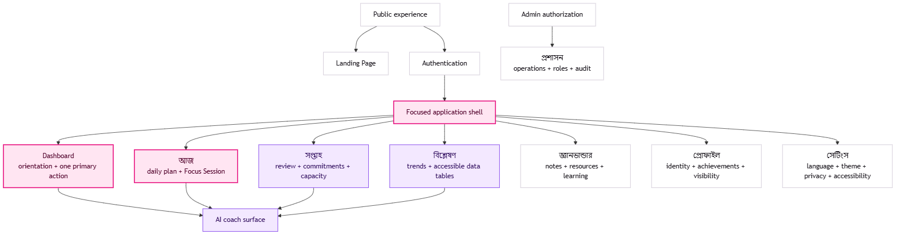
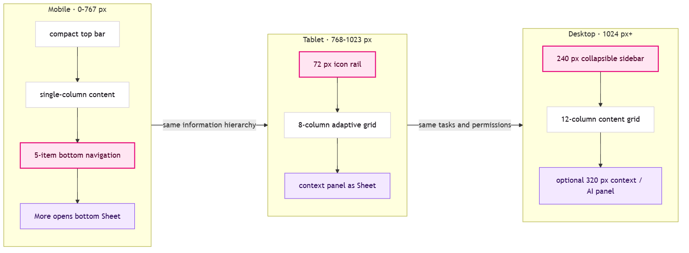
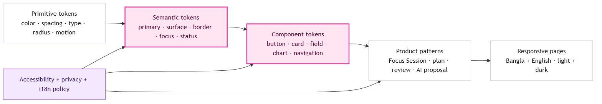

# Document Control

| Field | Value |
|---|---|
| Document | Focused Bangla-First UI/UX Design System |
| Version | 1.0 |
| Status | Implementation baseline |
| Product | Focused FocusOS |
| Default locale | `bn-BD` — human-authored natural Bangla |
| Secondary locale | `en` |
| Target surfaces | Responsive web, PWA, future mobile, Admin |
| Design owner | Product Design with Product and Accessibility review |
| Engineering owner | Frontend Platform / Design System |
| Review cadence | Each material brand, accessibility, or component change |

# 1. Design North Star

Focused should feel like a calm, highly capable personal coach: present when needed, quiet when the user is working, and never visually demanding attention for its own sake.

**Design expression: quiet focus, vivid intent.** Neutral surfaces provide calm. Neon Pink marks the single most important action or selected state. Purple supports AI, reflection, and secondary emphasis. Premium Black creates depth in dark mode without turning every surface into glossy glass.

The interface is not a wall of productivity metrics. It helps the member answer three questions in order:

1. এখন সবচেয়ে গুরুত্বপূর্ণ কাজ কোনটি?
2. কাজটি শুরু করতে পরের ছোট পদক্ষেপ কী?
3. কাজ শেষে কী শিখলাম এবং পরেরবার কী বদলাব?

## 1.1 Experience Principles

1. **One dominant action.** Every page has one clear primary action; competing calls to action use lower emphasis.
2. **Progress before decoration.** Visual polish supports comprehension, trust, and momentum. It never hides state or reduces contrast.
3. **Bangla is the original, not a translation.** Bangla copy is written and reviewed in Bangla. English is a separate authored locale.
4. **Private by posture.** Sensitive information is minimized, masked in shared spaces, and never exposed through decorative summaries or notification previews.
5. **Calm density.** Important information is nearby, but progressive disclosure keeps the first view easy to scan.
6. **Visible system state.** Saving, Sync, AI processing, Timer state, Offline state, conflicts, and errors are explicit.
7. **Motion explains change.** Animation shows continuity, hierarchy, or completion; it never blocks work or becomes a reward loop by itself.
8. **Accessible without a special mode.** Keyboard, screen-reader, contrast, text reflow, reduced motion, and touch requirements shape the default components.

## 1.2 Experience Anti-Patterns

- No dashboard with ten equally prominent cards.
- No full-page glass panels or low-contrast text over gradients.
- No Neon Pink paragraph text on light surfaces.
- No forced streak shame, loss framing, or manipulative countdowns.
- No hidden destructive action inside unlabeled icon-only controls.
- No AI suggestion that looks like an already-applied change.
- No machine-translated Bangla, literal English sentence structure, or unnecessary transliteration.
- No separate mobile feature set; responsive layouts preserve the same tasks and permissions.

{ width=100% }

# 2. Brand and Visual Language

## 2.1 Personality

| Attribute | Expression | Avoid |
|---|---|---|
| Focused | strong hierarchy, one bright action, generous space | competing highlights, noisy gradients |
| Premium | precise typography, restrained shadows, crisp borders | excessive blur, glossy chrome, fake luxury |
| Human | warm natural Bangla, forgiving empty states | robotic copy, blame, productivity guilt |
| Intelligent | contextual help, explainable AI proposals | mysterious automation, jargon-heavy UI |
| Disciplined | consistent spacing, predictable states | novelty layouts and inconsistent controls |

## 2.2 Logo Treatment

Use the wordmark `Focused` in its Latin form in both locales. The product name is never translated or transliterated. The preferred mark is a simple wordmark plus an optional focus-ring symbol. Do not place the logo inside a permanent neon glow. A subtle Neon Pink focus dot or ring is sufficient.

Minimum clear space equals the cap height of the `F`. Minimum digital width is 88 px for the wordmark and 24 px for the symbol. On dark surfaces use near-white lettering; on light surfaces use Premium Ink.

## 2.3 Color Strategy

Neon Pink is functional, not decorative. It identifies the primary action, active navigation, focus progress, and rare celebratory emphasis. Purple represents AI, planning insight, learning, and secondary selection. Status colors remain semantically stable and are never replaced by brand colors.

### Light theme

| Token | Value | Use |
|---|---|---|
| Background | `#F8F7FB` | page canvas |
| Foreground | `#17131A` | primary text |
| Card | `#FFFFFF` | normal content surface |
| Muted surface | `#F1EFF4` | secondary blocks, skeletons |
| Muted text | `#66616C` | descriptions and metadata |
| Border | `#E4DFE8` | cards, fields, separators |
| Primary | `#E60076` | primary button, active control, progress |
| Primary hover | `#C40063` | hover and high-contrast pink text |
| Primary foreground | `#FFFFFF` | text on primary; contrast target 4.5:1+ |
| Accent | `#7C3AED` | AI, secondary highlight, selected insight |
| Accent foreground | `#FFFFFF` | text on accent |
| Success | `#0F7A4F` | completed and healthy state |
| Warning | `#9A5500` | caution and approaching limit |
| Destructive | `#C62828` | destructive action and blocking error |

### Dark theme

| Token | Value | Use |
|---|---|---|
| Premium Black | `#09090B` | page canvas |
| Foreground | `#F7F7FA` | primary text |
| Card | `#111116` | normal content surface |
| Popover | `#15151B` | elevated menu or dialog |
| Muted surface | `#1B1A20` | secondary block |
| Muted text | `#A8A3AF` | metadata and descriptions |
| Border | `#2A2730` | structural outline |
| Primary | `#FF3D9A` | primary action and active state |
| Primary foreground | `#0B0B0F` | text on bright pink |
| Accent | `#A855F7` | AI and secondary emphasis |
| Accent foreground | `#0B0B0F` | text on accent |
| Success | `#43D49A` | positive state |
| Warning | `#F0A64A` | caution state |
| Destructive | `#FF6B6B` | error and destructive action |

### Contrast rules

- Normal text meets at least 4.5:1; large text meets at least 3:1.
- Interactive boundaries, icons conveying state, chart marks, and focus indicators meet at least 3:1 against adjacent colors.
- Neon Pink `#E60076` is allowed for filled controls with white text, icons, progress marks, and non-text emphasis. For pink text on the light canvas use `#C40063`.
- Never use opacity alone to create disabled text below a readable threshold. Disabled controls preserve legibility and reduce affordance through surface, cursor, and state copy.
- Every chart series has a pattern, marker, label, or table equivalent; color is never the only distinction.

## 2.4 Glassmorphism

Glass is a spatial cue, not the default card style.

**Approved surfaces:** sticky landing navigation, compact app top bar, command palette, modal/dialog, mobile bottom navigation, transient AI coach panel, and floating Timer controller.

**Normal content:** daily priorities, habits, goals, settings, analytics, and Admin data use opaque cards.

| Property | Light | Dark |
|---|---|---|
| Background | white at 72% | `#111116` at 76% |
| Blur | 20 px | 20 px |
| Saturation | 140% | 140% |
| Border | white at 82% | white at 9% |
| Radius | 16–24 px | 16–24 px |
| Fallback | opaque white | opaque `#111116` |

Text contrast is evaluated against the worst plausible background behind the glass. Forced Colors and no-blur environments receive an opaque system-color fallback.

## 2.5 Gradients and Illustration

Use a Pink-to-Purple gradient only for hero atmosphere, AI identity, progress celebration, or a thin active border. Do not use gradients behind body copy or dense data. Abstract illustrations should communicate flow, attention, or progress and must not imply that Focused guarantees outcomes.

# 3. Typography and Language

## 3.1 Type Family

Primary UI stack:

```css
font-family: "Inter Variable", "Noto Sans Bengali Variable",
  "Noto Sans Bengali", system-ui, sans-serif;
```

Inter renders Latin text and numerals; Noto Sans Bengali provides full Bangla shaping. Both are variable where available and may be self-hosted to improve reliability and privacy. Do not use condensed Bangla in interactive UI. Do not apply synthetic bold.

## 3.2 Type Scale

| Role | Desktop | Mobile | Weight | Bangla line height |
|---|---:|---:|---:|---:|
| Display | 56 px | 40 px | 700 | 1.16 |
| Page H1 | 40 px | 32 px | 700 | 1.24 |
| Section H2 | 32 px | 26 px | 650 | 1.30 |
| Card H3 | 24 px | 22 px | 650 | 1.38 |
| Title | 20 px | 18 px | 600 | 1.45 |
| Body | 16 px | 16 px | 400 | 1.62 |
| Label | 14 px | 14 px | 550 | 1.48 |
| Caption | 12 px | 12 px | 500 | 1.55 |
| Timer numeral | 64–96 px | 56–72 px | 650 | 1.0 |

Bangla uses zero letter spacing. Never apply `uppercase` transformations to Bangla. Avoid underlining long Bangla phrases; use color, weight, or a border with adequate clearance from vowel marks.

## 3.3 Bangla Editorial Standard

Bangla is authored by a native Bangla writer or editor. Machine Translation is prohibited for shipped interface copy, onboarding, notification content, help text, AI system prompts shown to users, and marketing pages.

Writing rules:

- Write direct, conversational Bangladesh Bangla; prefer short active sentences.
- Address the user respectfully with `আপনি`; avoid inconsistent shifts to `তুমি`.
- Preserve the approved English technical terms exactly: `API`, `Dashboard`, `Timer`, `AI`, `GitHub`, `LeetCode`, `Focus Session`, `Backend`, `Frontend`, `Database`, `Authentication`, and `Deployment`.
- Keep proper product names, model names, code, URLs, keyboard keys, file paths, and version identifiers in English.
- Add `lang="en"` to meaningful embedded English phrases when practical so assistive technology changes pronunciation.
- Avoid literal translations such as “ক্লিক করুন” when the control already has a clear action label. Prefer the action itself: `সংরক্ষণ করুন`, `শুরু করুন`, `ফিরে যান`.
- Use ellipsis only for an active process: `তথ্য আনা হচ্ছে…`; do not use it to make labels sound conversational.

## 3.4 Numerals, Dates, and Time

Narrative dates and general counts follow the selected locale with `Intl.DateTimeFormat` and `Intl.NumberFormat`. Operational values that users compare across tools—Timer countdown, code metrics, `XP`, GitHub contributions, LeetCode counts, IDs, and keyboard shortcuts—use Latin numerals. Never concatenate translated date fragments manually.

Default locale is `bn-BD`; default time zone is the member’s saved IANA zone, falling back to the device zone during onboarding. Calendar weeks, prayer times, and reminders must not assume `Asia/Dhaka` after the member changes location.

## 3.5 Copy Examples

| Intent | Preferred Bangla | Avoid |
|---|---|---|
| Empty daily plan | আজকের প্রধান কাজ এখনো ঠিক করা হয়নি | কোনো ডেটা পাওয়া যায়নি |
| Save success | পরিবর্তন সংরক্ষিত হয়েছে | সফলভাবে সেভ করা হয়েছে |
| Recoverable error | কিছু একটা ঠিকমতো কাজ করেনি। একটু পর আবার চেষ্টা করুন। | Error 500 |
| AI proposal | কোনো পরিবর্তন আপনার অনুমতি ছাড়া কার্যকর হবে না। | AI এটি করে দেবে |
| Offline | আপনি এখন Offline আছেন। সংযোগ ফিরলে পরিবর্তনগুলো Sync হবে। | Network unavailable |
| Destructive | এই তথ্য মুছে ফেললে আর ফেরানো যাবে না। | আপনি কি নিশ্চিত? |

# 4. Layout and Responsive System

{ width=100% }

## 4.1 Breakpoints and Grid

| Range | Grid | Gutter | Navigation | Context panel |
|---|---|---:|---|---|
| 0–639 px | 4 columns | 16 px | bottom navigation | full-screen or bottom Sheet |
| 640–767 px | 4 columns | 20 px | bottom navigation | bottom Sheet |
| 768–1023 px | 8 columns | 24 px | 72 px icon rail | right Sheet |
| 1024–1279 px | 12 columns | 24 px | 224–240 px sidebar | overlay or 288 px panel |
| 1280 px+ | 12 columns | 32 px | 240 px sidebar | optional 320 px panel |

Maximum application content width is 1440 px. Reading content is limited to 760 px and long forms to 640 px. The shell may span wider, but text lines and forms do not.

## 4.2 Density

Default spacing uses a 4 px base: 4, 8, 12, 16, 20, 24, 32, 40, 48, 64, 80, and 96 px. Bangla labels need slightly more vertical room than equivalent English labels. Do not solve dense screens by reducing text below the defined scale.

## 4.3 App Shell

**Desktop:** persistent sidebar, page header, scrollable content, and optional right context/AI panel. Sidebar collapses to an icon rail; collapse preference persists per device.

**Tablet:** icon rail plus adaptive content. Secondary inspectors and AI appear as a Sheet so the main task retains width.

**Mobile:** compact top bar and five bottom destinations: `Dashboard`, `আজ`, `সপ্তাহ`, `বিশ্লেষণ`, and `আরও`. The More Sheet contains goals, knowledge, profile, settings, and context-specific destinations. Bottom navigation respects safe-area insets and never covers focused controls.

## 4.4 Page Header

Page headers contain breadcrumb where useful, one H1, optional short description, and at most one primary action. Filters and view toggles appear beneath the header on mobile rather than compressing the title row.

## 4.5 Card Layout

- Standard cards use 16 px radius, 20–24 px padding, opaque surfaces, a 1 px border, and restrained shadow.
- Interactive cards have a visible hover boundary and focus ring; the entire card is clickable only when it performs exactly one action.
- Do not nest more than one card level. Use sections, separators, or inset surfaces instead.
- Card order follows task priority, not implementation ownership.

# 5. Shape, Elevation, and Iconography

## 5.1 Radius

| Token | Value | Use |
|---|---:|---|
| Control | 12 px | buttons, inputs, selects |
| Card | 16 px | normal cards and list containers |
| Panel | 20 px | Sheet, dialog, AI panel |
| Hero | 24 px | landing preview and major summary |
| Pill | 999 px | badges, segmented controls, status chips |

## 5.2 Elevation

Borders establish structure; shadows establish temporary elevation. Normal dark-mode cards rely on borders rather than large shadows. Dropdowns, floating Timer controls, command palette, and dialogs use medium elevation. Neon glow is reserved for an active primary button, current Timer progress, or a brief completion moment.

## 5.3 Icons

Use Lucide icons or an equivalently consistent outline set. Standard sizes are 16, 18, 20, and 24 px with approximately 1.75 px stroke. Every icon-only control has an accessible name and Tooltip. Decorative icons are hidden from assistive technology.

Avoid culture-specific metaphors where a plain label is clearer. The prayer and Quran experiences require product/content review before using religious symbols.

# 6. Motion and Micro-Interactions

## 6.1 Motion Tokens

| Token | Duration | Use |
|---|---:|---|
| Instant | 80 ms | press feedback |
| Fast | 120 ms | hover, focus, icon state |
| Standard | 180 ms | menus, tabs, small panels |
| Deliberate | 240 ms | dialog and Sheet transitions |
| Enter | 320 ms | page-local reveal, success summary |

Use `cubic-bezier(0.2, 0, 0, 1)` for normal transitions and `cubic-bezier(0.2, 0.8, 0.2, 1)` for emphasized entrances. Exit motion is shorter than entrance motion.

## 6.2 Approved Micro-Interactions

- Primary button compresses to 98% for 80 ms on pointer press; keyboard activation receives the same state without scale dependence.
- Habit completion draws a check and updates progress within 180 ms; the label remains readable and undo is available.
- Starting a Focus Session moves the selected task into the Timer controller and announces the new state through a polite live region.
- Timer completion uses one pulse and an optional restrained particle burst; it is skipped with reduced motion or when celebrations are disabled.
- AI streaming shows a calm activity indicator and progressive text; it never uses fake typing delays.
- Saved settings show inline confirmation near the changed section rather than relying only on a Toast.

## 6.3 Reduced Motion

`prefers-reduced-motion: reduce` removes parallax, particles, progress sweeps, scale transitions, auto-animated charts, and smooth scrolling. State changes remain visible through text, icon, color, and immediate layout updates.

{ width=100% }

# 7. Component System

All components wrap accessible shadcn/ui primitives where practical. Feature teams may compose components but may not fork base interaction behavior without a design-system review.

## 7.1 Required Component States

Every relevant component defines:

- default, hover, active, focus-visible, selected, and disabled;
- loading or pending with layout-preserving Skeleton where data shape is known;
- empty with a reason and useful next step;
- recoverable error with Retry;
- validation error associated with its field;
- success confirmation;
- Offline, stale, and Sync-pending state for mutable data;
- light, dark, high-contrast/Forced Colors, and reduced-motion behavior;
- Bangla and English wrapping at 200% zoom and narrow widths.

## 7.2 Buttons

| Variant | Use | Rules |
|---|---|---|
| Primary | the page’s single dominant action | Neon Pink fill; one per visible decision area |
| Secondary | important alternative | neutral or soft Purple surface |
| Outline | reversible utility action | visible border; no glass |
| Ghost | low-emphasis navigation or toolbar | hover surface required |
| Destructive | confirmed destructive action | red only; never brand Pink |
| Link | inline navigation | descriptive text and clear hover/focus treatment |

Heights are 44 px default, 36 px compact for dense desktop toolbars only, and 52 px for landing/onboarding emphasis. Mobile actions remain at least 44 px high. Loading buttons keep their width, retain the action label where possible, and prevent duplicate submission.

## 7.3 Form Controls

Inputs, Textarea, Select, Combobox, Checkbox, Radio Group, Switch, Slider, Date Picker, and segmented controls use visible labels. Placeholder text never replaces a label. Helper and error text occupy a stable region when practical so validation does not cause disruptive movement.

Bangla field labels may wrap to two lines. Controls align to the first label baseline rather than forcing equal row heights. Numeric input displays locale formatting but submits normalized values. Password fields support reveal/hide, password managers, paste, and accessible Authentication without cognitive puzzles.

## 7.4 Navigation

| Component | Desktop | Tablet | Mobile |
|---|---|---|---|
| Primary navigation | labeled sidebar | icon rail with Tooltip | five-item bottom bar |
| Page navigation | Tabs or local sidebar | Tabs / Select | horizontally scrollable Tabs or Select |
| Breadcrumb | visible on deep routes | shortened | omitted when Back + title is clearer |
| Command palette | centered dialog | centered dialog | full-screen dialog |

Active state combines shape, weight, and color. Pink is never the only active signal. Navigation preserves focus after route transitions and announces the new page title.

## 7.5 Feedback and Overlay

- **Alert:** persistent page-local information requiring reading.
- **Toast:** brief confirmation for background or cross-page events; never the only location of an error.
- **Dialog:** focused decision with limited content.
- **Alert Dialog:** irreversible or high-impact confirmation.
- **Sheet/Drawer:** supporting workflow or mobile inspector.
- **Popover:** short contextual control; not long forms.
- **Tooltip:** label or clarification, not required instructions.
- **Progress:** determinate whenever actual progress exists; indeterminate only during unknown waits.

Focus is trapped inside modal surfaces, returns to the invoker, and is never obscured by sticky headers or bottom navigation.

## 7.6 Data Display

Tables are used for genuinely comparable data, especially Admin and report details. On mobile, priority columns remain visible and secondary columns move into a disclosure row; do not turn every row into an unrelated stack of labels.

Charts provide:

- visible title, time range, unit, and comparison basis;
- direct data labels or an accessible legend;
- keyboard-reachable points when interactive;
- a data table alternative;
- empty and partial-data explanations;
- pattern/marker differences in addition to color;
- no decorative 3D, perspective, or chart animation that delays reading.

## 7.7 Core Product Components

### Focus Priority Card

Displays title, outcome, planned duration, linked goal, and readiness. Primary action is `Focus Session শুরু করুন`. Secondary actions live in a menu. Completion, carry-forward, and remove are explicit decisions; dragging is never the only reordering method.

### Timer Controller

Shows authoritative elapsed/remaining time, current task, phase, Pause/Resume, Finish, and interruption logging. The countdown is not implemented as a continuously decrementing client counter; visual time derives from timestamps. Background/tab throttling reconciles on visibility change.

Timer requirements:

- Latin numerals for fast scanning;
- at least 56 px numerals on mobile and 72 px on desktop;
- no color-only phase distinction;
- optional sound and vibration, both controllable;
- live-region announcements only at meaningful milestones, not every second;
- accidental close preserves the active Session;
- Offline completion queues an idempotent Sync operation.

### Habit Row

Contains habit name, schedule context, completion control, optional compact streak, and overflow menu. The checkbox/control has a 44 px target. Undo is available after completion. Missed habits are neutral, not red failures.

### Goal Card

Shows desired outcome, status, horizon, progress evidence, next milestone, and next action. Progress is evidence-based rather than an arbitrary percentage when the domain cannot justify a number.

### Planning Capacity Meter

Compares available capacity with committed time. Warning appears before overcommitment. It explains the tradeoff in natural Bangla and offers actions to reduce scope, move work, or extend capacity; it does not simply turn red.

### Distraction Log

Opens as a fast Sheet during a Focus Session. A member selects or writes the cause in one or two taps, then returns to the Timer. Categories remain editable after the Session. Sensitive free text is private and excluded from notification previews.

### AI Coach Panel

The AI panel is a restrained glass surface with Purple identity and Pink only for an approved action. It shows scope, sources, processing state, model limitations, and whether a response is a suggestion or a proposed change.

An AI proposal contains:

1. proposed change;
2. reason and evidence;
3. affected record and current value;
4. Accept and Reject actions;
5. expiry or stale-version notice.

No proposal uses a preselected acceptance control. Applying a change requires explicit action and displays a normal domain result, not an AI-only success state.

### Review Card

Daily, weekly, and monthly reviews share one pattern: evidence summary, guided questions, member reflection, optional AI synthesis, and explicit next decisions. The member’s writing is visually primary; AI content is clearly labeled and secondary.

### Streak and XP

Streaks and XP are supporting feedback. They never dominate the Dashboard, create public pressure by default, or imply moral failure. Reduced-gamification settings hide celebratory animation and de-emphasize totals without removing earned history.

## 7.8 Component Acceptance Checklist

For every new component, reviewers verify:

- semantic HTML or correct ARIA pattern;
- keyboard operation and logical focus order;
- visible focus with 2 px ring and 2 px offset;
- 44 px preferred touch target and no target below WCAG minimum without allowed spacing exception;
- light/dark contrast;
- Bangla wrap, English wrap, long name, and 200% zoom;
- loading, empty, error, disabled, and Offline behavior;
- reduced-motion behavior;
- no private content in analytics, logs, screenshots, or notification previews;
- automated tests plus a manual screen-reader and keyboard check for high-risk primitives.

# 8. Page Blueprint: Landing Page

## 8.1 Objective

Communicate Focused as a Focus Operating System, not a habit tracker, and move qualified visitors toward a low-friction start.

## 8.2 Structure

1. **Glass navigation:** wordmark, `ফিচার`, `কীভাবে কাজ করে`, `গোপনীয়তা`, language, theme, `Sign in`, and primary `বিনামূল্যে শুরু করুন`.
2. **Hero:** eyebrow `আপনার ব্যক্তিগত FocusOS`; H1 `মনোযোগ ধরে রাখুন। প্রতিদিন একটু করে এগিয়ে যান।`; one paragraph; primary and secondary actions.
3. **Product stage:** desktop Dashboard preview with Daily Focus, Timer, and AI coach; on mobile show one clear stacked preview rather than a miniature desktop screenshot.
4. **Three outcomes:** deep work, realistic planning, and guided reflection.
5. **How it works:** `পরিকল্পনা করুন → Focus Session চালান → পর্যালোচনা করুন → উন্নতি করুন`.
6. **Trust and privacy:** private-by-default, scoped AI context, export/delete controls.
7. **Final CTA:** a calm action block, not a countdown or fake scarcity message.
8. **Footer:** product, resources, accessibility, privacy, language, and system status.

## 8.3 Visual Direction

Use a near-white/light-lavender canvas, soft radial Pink/Purple atmosphere behind the product stage, and opaque product cards. Dark mode uses Premium Black with restrained edge light. Hero copy remains high contrast; the gradient never sits directly behind body text.

## 8.4 Responsive Behavior

- Mobile navigation collapses to Menu; theme and language remain directly reachable.
- Hero centers only on narrow mobile; larger layouts use a left-aligned 5/7 split.
- Product stage scrolls or rearranges; it never scales desktop UI below readable size.
- CTA buttons stack full width below 360 px and remain intrinsic width otherwise.

## 8.5 States and Acceptance Criteria

- Marketing content is server-rendered with correct `lang`, metadata, canonical, alternate locale links, and structured data.
- No layout shift occurs when fonts load; fallback metrics are tuned.
- Primary CTA works with keyboard and announces destination.
- Motion pauses with reduced motion; hero atmosphere remains static.
- Bangla text has been native-edited and does not overflow at 320 px or 200% zoom.
- If app status or sign-in dependency is unavailable, CTA leads to a clear recoverable state.

# 9. Page Blueprint: Dashboard

## 9.1 Objective

Orient the member in under five seconds and provide one obvious next action without turning the page into a metric wall.

## 9.2 Desktop Composition

- **Header:** `শুভ সকাল, {name}` plus `আজকের দিনটা পরিষ্কারভাবে শুরু করা যাক।`
- **Primary band (8 columns):** Today Focus card with up to three priorities and primary `Focus Session শুরু করুন`.
- **Coach prompt (4 columns):** a short AI coach entry point; collapsed when unused.
- **Second row:** weekly progress, planned vs focused time, and next calendar block.
- **Third row:** habit summary and distraction insight; use progressive disclosure for details.
- **Floating Timer:** visible only when a Session is active.

## 9.3 Mobile Composition

Greeting, active Timer/primary action, today priorities, next event, compact weekly progress, habits, and AI prompt. Analytics details move behind `সব দেখুন`. Bottom navigation remains stable.

## 9.4 Empty, Loading, Error, and Offline

- No priorities: explain why choosing one helps and offer `প্রধান কাজ যোগ করুন`.
- New account: show a three-step guided start, not eight empty cards.
- Loading: skeletons match final card geometry; the primary action does not jump.
- Partial failure: healthy cards remain usable; failed card shows its own Retry.
- Offline: cached today plan remains visible; queued changes show Sync-pending status.

## 9.5 Acceptance Criteria

- Exactly one primary button is visible above the fold.
- Sensitive journal, mood, faith, or health details never appear in a generic Dashboard preview without explicit configuration.
- Cards follow a meaningful heading order and landmarks.
- Dashboard is useful with zero analytics history.
- Active Timer survives route change, refresh, and breakpoint change.
- Screen-reader order matches the visual priority order.

# 10. Page Blueprint: Daily Page

## 10.1 Objective

Help the member create a realistic day, complete focused work, record interruptions, and close the day intentionally.

## 10.2 Structure

1. Date navigation and status (`পরিকল্পনা চলছে`, `দিন শুরু হয়েছে`, `পর্যালোচনা বাকি`, `সম্পন্ন`).
2. Capacity chooser: low, normal, or high with optional time estimate.
3. Up to three priorities with expected outcomes.
4. Focus Session queue with estimated time and linked Timer preset.
5. Calendar/time-block context.
6. Today’s habits and essential wellbeing/faith trackers selected by the member.
7. Distraction log summary.
8. Daily review and carry-forward decisions.

Desktop uses a main planning column and a sticky context rail. Mobile uses one sequence; the active Timer replaces nonessential sticky actions.

## 10.3 Interaction Rules

- Dragging may reorder tasks, but Move Up/Down controls are always available.
- Optimistic changes show immediate state and revert with an explanation when rejected.
- A task cannot silently move to tomorrow; carry-forward is an explicit decision.
- Completing a priority asks for an outcome only when the domain needs it; avoid modal fatigue.
- Closing the day never requires every optional tracker.

## 10.4 Acceptance Criteria

- The member can add a priority and start a Focus Session using keyboard only.
- Overcommitment warning explains the capacity conflict and offers corrective actions.
- Date, time, and recurrence display use locale/time-zone utilities.
- Offline edits retain their mutation order and expose conflicts for resolution.
- Empty habits or calendar integrations do not leave blank card shells.

# 11. Page Blueprint: Weekly Page

## 11.1 Objective

Convert reflection into a small set of commitments that fit the member’s actual capacity.

## 11.2 Structure

- Previous week evidence and reflection.
- Desired weekly outcome.
- Capacity by day and known fixed commitments.
- Goal/milestone candidates.
- Commitment list with expected result and estimated effort.
- Risk/obstacle planning.
- Calendar allocation preview.
- Optional AI weekly synthesis and proposal.

The page uses a stepper on mobile and a two-column planning canvas on desktop. The member can save a draft at any step. Step completion is not represented as success unless the plan is internally valid.

## 11.3 Acceptance Criteria

- The plan can be completed without AI.
- AI never modifies commitments or calendar blocks without explicit acceptance.
- Capacity conflicts are visible before finalization.
- A member may skip qualitative reflection and still plan the week.
- Week start follows locale/member preference.
- Draft and finalized states are visually distinct and announced.

# 12. Page Blueprint: Analytics

## 12.1 Objective

Help members understand behavior and make better decisions, not merely display more numbers.

## 12.2 Information Hierarchy

1. time range and comparison basis;
2. one narrative insight;
3. focus time, completion, distraction, and consistency summaries;
4. trend chart;
5. cause breakdown and optional correlations;
6. accessible table and export;
7. data-quality explanation.

Pink represents primary focus progress. Purple represents comparison or AI-derived insight. Status colors retain their semantic meaning. Mood, sleep, prayer, Quran, workout, or health correlations are opt-in and avoid causal claims.

## 12.3 States

- No data: recommend completing a few Focus Sessions; do not show zero as failure.
- Partial range: mark incomplete days and avoid misleading averages.
- Processing: show last calculated time and a nonblocking update state.
- Private data excluded: explain which categories are not included and why.
- Export running: return a durable job state rather than blocking the page.

## 12.4 Acceptance Criteria

- Every chart has a table equivalent and meaningful text alternative.
- Tooltips are keyboard and touch accessible.
- Comparison labels specify period and unit.
- Color is not the only series distinction.
- Insight copy distinguishes observation from inference.
- Large datasets paginate or aggregate; the browser does not receive unbounded records.

# 13. Page Blueprint: Profile

## 13.1 Objective

Provide identity, progress, and achievement context without encouraging unsafe public comparison.

## 13.2 Structure

- Avatar, display name, short bio, locale, and time zone.
- Personal direction summary selected by the member; private by default.
- Achievements, Levels, XP, and streaks with a reduced-gamification option.
- Connected accounts such as GitHub where authorized.
- Visibility controls that preview what another person would see.
- Security shortcut to active sessions and linked Authentication methods.

Editing occurs in a focused form or Sheet, not by turning every label into an inline field. Public sharing is granular and off by default.

## 13.3 Acceptance Criteria

- The public preview never includes private journals, mood, faith, health, sleep, calendar details, or AI conversations.
- Avatar upload validates format, size, crop, alt/description need, and removal.
- A member can remove a connected account without losing the primary sign-in method accidentally.
- Achievement animation respects reduced motion and reduced gamification.
- Display names and Bangla text wrap without truncating essential identity.

# 14. Page Blueprint: Settings

## 14.1 Information Architecture

Desktop uses a local settings sidebar; mobile uses a list-to-detail flow.

1. `অ্যাকাউন্ট`
2. `দেখার ধরন`
3. `ভাষা`
4. `Accessibility`
5. `নোটিফিকেশন`
6. `গোপনীয়তা`
7. `তথ্য ও Export`
8. `Authentication ও নিরাপত্তা`
9. `Integration`

## 14.2 Language and Appearance

Language controls show `বাংলা` and `English` in their own language. Changing locale updates visible UI immediately and persists after confirmation; unsaved forms warn before a route-changing locale switch.

Theme options are `হালকা`, `গাঢ়`, and `ডিভাইস অনুযায়ী`. The selector previews surface, text, Pink primary, and Purple accent. Do not animate every surface during theme change; suppress global theme transitions to avoid flicker and motion discomfort.

## 14.3 Accessibility Settings

Provide explicit controls for reduced motion, reduced celebration, higher contrast, larger data labels, sound, vibration, chart table default, and Timer milestone announcements. System preferences are the starting point; a member override is stored per account and available before sign-in where feasible.

## 14.4 Notifications and Privacy

Notifications are grouped by purpose and channel with quiet hours, urgency, and preview privacy. A global off switch does not hide channel-specific explanation. Privacy settings use plain language, show current effect, and link to export/delete workflows.

## 14.5 Acceptance Criteria

- Settings use clear Save behavior: immediate for reversible preferences, explicit Save for grouped or consequential changes.
- Unsaved changes are protected on navigation.
- Security changes require recent Authentication where policy requires it.
- Destructive actions are separated from normal settings and require consequence-specific confirmation.
- Language change does not submit, discard, or reinterpret user-authored content.
- Every notification preview has a privacy-safe form.

# 15. Page Blueprint: Admin

## 15.1 Objective

Support safe platform operations without making private member content routinely visible.

## 15.2 Visual Direction

Admin uses the same foundations but a denser, enterprise-neutral composition. Pink remains the primary action color; operational status uses status colors. Glass is limited to global navigation and command palette. Data tables and filters use opaque surfaces.

## 15.3 Structure

- System health and current incidents.
- User lookup with privacy-safe metadata.
- Roles, permissions, and support elevation.
- Feature Flags and rollout status.
- Background jobs, queues, and retry/dead-letter operations.
- Notification delivery health.
- AI provider quota/latency health without prompt content.
- Audit Log with actor, reason, target, result, and correlation ID.

## 15.4 Privileged Interaction Rules

- Privileged action buttons include the actual consequence: `Session বাতিল করুন`, not `Proceed`.
- Reason is required before sensitive support or administrative action.
- Step-up Authentication appears before exposing or changing sensitive controls.
- Destructive bulk action requires explicit selection count and typed confirmation only when risk justifies the burden.
- Support impersonation, if ever introduced, is bannered, time-limited, audited, and visually impossible to confuse with a normal member session.

## 15.5 Acceptance Criteria

- Route, server render, data query, and action all enforce RBAC; hidden controls are not authorization.
- Private content is absent by default and access is auditable where exceptional viewing is legally/product-approved.
- Tables support keyboard navigation, pagination, column visibility, empty results, and saved filters without trapping focus.
- Every retry or bulk action is idempotent or warns clearly when it cannot be.
- Operational charts have units, thresholds, and accessible tables.

# 16. Accessibility Standard

Focused targets WCAG 2.2 AA across public, authenticated, and Admin experiences. AAA criteria are adopted selectively where they materially improve focus visibility and readability.

## 16.1 Interaction

- All functionality works with keyboard and common assistive technologies.
- Focus order follows reading/task order; route changes move focus to the page H1 or an appropriate preserved point.
- Focus indicator uses at least a 2 px perimeter-equivalent with 3:1 contrast and 2 px offset.
- Sticky headers, bottom navigation, Toasts, and Timer controls never obscure focused content.
- Touch targets are designed at 44 x 44 px or larger. Smaller visual marks receive an enlarged hit area while keeping adequate separation.
- Dragging always has a non-drag alternative.
- Hover content is dismissible, hoverable, and persistent long enough to use.

## 16.2 Semantics and Screen Readers

- One H1 per page; headings do not skip levels for styling.
- Page regions use `header`, `nav`, `main`, `aside`, and `footer` landmarks.
- Buttons perform actions; links navigate.
- Form errors are associated with fields and summarized after failed submit.
- Live regions are limited to meaningful changes: save complete, Session started/paused/completed, Sync failure, and AI run completion.
- Timer does not announce every second.
- Charts expose a concise summary and data table.
- Bangla pages use `lang="bn-BD"`; embedded English technical terms may use `lang="en"` when pronunciation benefits.

## 16.3 Visual and Cognitive

- Text reflows without two-dimensional scrolling at 320 CSS px, except essential data grids with an accessible alternative.
- Text remains usable at 200% browser zoom and with user text-spacing overrides.
- Instructions do not depend on color, shape, location, sound, or motion alone.
- Error messages state what happened and how to recover.
- Authentication supports password managers, paste, OAuth, and passkey-ready patterns; no memory puzzle is required.
- Time limits are avoidable or extendable except where security requires otherwise.
- Reduced-motion and reduced-gamification controls do not remove information.

## 16.4 Glass and Dark Mode Audit

Each glass surface is tested against worst-case content beneath it. Blur-disabled and Forced Colors modes use opaque surfaces. Dark mode is not an inverted light theme: card borders, muted text, focus ring, chart palette, illustrations, and shadows receive independent review.

# 17. Internationalization Architecture

## 17.1 Locale Model

- Supported locales: `bn-BD` default and `en` secondary.
- Public routes use locale segments: `/bn-BD/...` and `/en/...`.
- Authenticated locale preference is stored on the profile and reconciled with route preference.
- Root layouts set `lang`; direction remains `ltr` for both current locales.
- Dictionaries are feature-scoped, server-loaded by default, statically typed, and code-split.
- User-authored text is never translated automatically when locale changes.

## 17.2 Translation Workflow

1. Product/design writes intent, context, character guidance, and English technical-term locks.
2. Native Bangla writer authors the Bangla string directly.
3. A second native reviewer checks naturalness, grammar, tone, and ambiguity.
4. Design checks wrapping in narrow/mobile and 200% zoom contexts.
5. Accessibility reviews labels, announcements, error recovery, and language-of-parts behavior.
6. Engineering snapshots the key and prevents untranslated fallback in production Bangla routes.

Machine-generated Bangla may be used only as an internal brainstorming aid when no generated phrase reaches a user or the translation repository. It is never accepted as final copy.

## 17.3 Locked Terminology

The following remain English exactly as approved: `API`, `Dashboard`, `Timer`, `AI`, `GitHub`, `LeetCode`, `Focus Session`, `Backend`, `Frontend`, `Database`, `Authentication`, and `Deployment`.

The glossary is versioned. New technical terms require product-content review; teams may not independently transliterate the same term in different features.

## 17.4 Formatting

Use the `Intl` platform for numbers, dates, relative time, lists, units, and plurals. Never interpolate grammar-sensitive fragments. Message keys describe meaning, not English wording: `dashboard.noPriorityTitle`, not `no_data`.

Pseudo-locales test expansion, missing keys, and embedded technical terms. Bangla QA includes conjuncts, diacritics, punctuation, mixed Latin/Bangla lines, long personal names, and Latin numeral alignment.

## 17.5 Search and Input

Search normalizes Unicode safely without changing stored user text. Bangla keyboard input, composition events, phonetic keyboards, paste, and mobile IME behavior are tested. Validation never runs destructively during an unfinished composition.

# 18. Theme and State Implementation

shadcn/ui semantic CSS variables are the component contract. Feature code uses `bg-background`, `text-foreground`, `bg-primary`, `text-muted-foreground`, `border-border`, and related semantic utilities. Raw Pink/Purple values are limited to the token source and approved data-visualization definitions.

`next-themes` applies the `.dark` class, respects the system preference, and suppresses hydration mismatch. An inline pre-hydration theme script or supported provider behavior prevents flash. Theme changes disable global transitions during the switch.

State ownership:

- theme and reduced-motion preference: account preference plus early local hint;
- locale: route plus authenticated profile preference;
- sidebar: device-local preference;
- dialog/Sheet/menu: local ephemeral state;
- server state: TanStack Query or Server Component data as defined by architecture;
- durable drafts: IndexedDB-backed repository;
- active Timer: server-authoritative timestamps with local projection.

# 19. Frontend Package Structure

```text
apps/web/src/
|-- app/[locale]/
|   |-- (marketing)/
|   |-- (auth)/
|   |-- (app)/
|   `-- admin/
|-- components/
|   |-- ui/                     # reviewed shadcn primitives
|   |-- focused/                # product components
|   `-- patterns/               # page-level compositions
|-- features/
|   |-- dashboard/
|   |-- daily-focus/
|   |-- weekly-planning/
|   |-- analytics/
|   |-- profile/
|   |-- settings/
|   `-- administration/
|-- design-system/
|   |-- tokens.css
|   |-- tokens.ts
|   |-- motion.ts
|   `-- chart-theme.ts
|-- i18n/
|   |-- dictionaries/
|   |   |-- bn-BD/
|   |   `-- en/
|   |-- glossary.ts
|   |-- get-dictionary.ts
|   `-- formatters.ts
|-- providers/
|   |-- theme-provider.tsx
|   `-- locale-provider.tsx
`-- tests/
    |-- a11y/
    |-- visual/
    |-- i18n/
    `-- interaction/
```

## 19.1 API Rules for Components

- Prefer controlled/uncontrolled conventions used by React primitives.
- Variants are finite and semantic; avoid arbitrary `color="pink"` props.
- Components forward refs where required by primitives.
- `className` extends layout but cannot silently defeat required focus, contrast, or hit-area behavior.
- Async callbacks expose pending state and prevent duplicate mutation.
- Visible strings come from typed dictionaries except user content and server-originated domain messages mapped to locale keys.

# 20. Testing Strategy

## 20.1 Automated

- TypeScript validates dictionary shape and component variants.
- ESLint blocks raw color values outside design-system files and untranslated literals in production UI.
- Unit tests cover state transitions and locale formatters.
- Component tests cover keyboard, focus, form labeling, errors, dialogs, Sheets, and Timer controls.
- axe checks run on Storybook/component and representative page states.
- Visual regression covers light/dark, Bangla/English, mobile/tablet/desktop, empty/loading/error, reduced motion, and 200% zoom reference states.
- End-to-end tests cover onboarding, daily planning, Focus Session, weekly plan, language/theme switch, analytics table, export, and privileged Admin actions.

## 20.2 Manual Release Gate

- Native Bangla editorial review.
- Keyboard-only critical journey.
- NVDA + Chrome and VoiceOver + Safari representative journey.
- TalkBack or VoiceOver mobile check.
- 320 px reflow and 200% zoom.
- Light/dark contrast audit including glass overlays.
- Reduced motion, Forced Colors, Offline, slow network, and font failure.
- Touch target and one-handed mobile reach check.

## 20.3 Performance Budgets

- Fonts are subset/self-hosted responsibly and preloaded only when needed.
- Landing critical CSS and hero avoid large client bundles.
- No animation library is loaded for interactions achievable with CSS.
- Charts lazy-load below the fold and provide server-rendered summaries.
- Glass blur area is limited to prevent GPU-heavy full-screen repaint.
- Skeletons reserve geometry and Core Web Vitals are tracked by route/locale/theme.

# 21. Design System Governance

## 21.1 Source of Truth

| Artifact | Authority |
|---|---|
| `design-system/tokens.css` | semantic light/dark theme contract |
| `design-system/tokens.ts` | spacing, typography, radius, motion, breakpoints |
| `design-system/i18n/bn-BD.ts` | reviewed Bangla reference copy and glossary lock |
| `design-system/i18n/en.ts` | secondary English key parity |
| Storybook | rendered component behavior and states |
| This specification | UX rules, page blueprints, acceptance criteria, governance |

## 21.2 Change Process

1. Open a design-system proposal with problem, evidence, affected components, and migration plan.
2. Review Product, Design, Frontend, Accessibility, and Content impact.
3. Update tokens/components centrally and add deprecation notice where needed.
4. Run visual, accessibility, locale, and interaction regression.
5. Publish version and migration notes.
6. Remove deprecated behavior only after consumers migrate.

New one-off visual values are rejected unless they represent a new reusable semantic need. Feature experiments use Feature Flags and do not fork accessibility behavior.

# 22. Implementation Order

1. Fonts, semantic tokens, theme provider, locale routing, dictionaries, and formatting utilities.
2. Button, field, card, navigation, feedback, overlay, Skeleton, Empty, and error primitives.
3. App shell for mobile/tablet/desktop plus command palette.
4. Focus Priority Card, Timer Controller, Habit Row, capacity meter, and Review Card.
5. Landing Page and onboarding.
6. Dashboard and Daily Page.
7. Weekly Page and AI proposal pattern.
8. Analytics charts plus accessible tables.
9. Profile and Settings.
10. Admin data table, privileged action, and audit patterns.
11. Full Storybook, visual regression matrix, accessibility gate, and native Bangla content QA.

# 23. Definition of Done

A page or component is complete only when:

- Bangla and English content are authored and key-complete;
- light and dark themes are reviewed;
- mobile, tablet, desktop, 320 px reflow, and 200% zoom are verified;
- semantic HTML, keyboard, focus, screen-reader, contrast, and target size pass;
- loading, empty, error, success, disabled, Offline, stale, and Sync states are designed where relevant;
- motion and reduced-motion behavior are defined;
- privacy and authorization effects are reviewed;
- analytics/telemetry avoid private content;
- automated tests and manual high-risk checks pass;
- metadata, page title, language attributes, and locale alternates are correct;
- Storybook and design-system documentation are updated.

# 24. Primary References

This baseline uses the following primary references as of 31 July 2026:

- WCAG 2.2: https://www.w3.org/TR/WCAG22/
- W3C Bengali Layout Requirements: https://www.w3.org/International/ilreq/bengali/
- Noto Sans Bengali: https://notofonts.github.io/noto-docs/specimen/NotoSansBengali/
- Next.js internationalization: https://nextjs.org/docs/app/guides/internationalization
- shadcn/ui theming: https://ui.shadcn.com/docs/theming
- shadcn/ui dark mode for Next.js: https://ui.shadcn.com/docs/dark-mode/next

# Appendix A. Representative Bangla Interface Copy

| Context | Bangla |
|---|---|
| Landing H1 | মনোযোগ ধরে রাখুন। প্রতিদিন একটু করে এগিয়ে যান। |
| Dashboard support | আজকের দিনটা পরিষ্কারভাবে শুরু করা যাক। |
| Primary focus action | Focus Session শুরু করুন |
| Empty priorities | আজকের প্রধান কাজ এখনো ঠিক করা হয়নি |
| Daily guidance | কম কাজ বেছে নিন, কিন্তু গুরুত্বপূর্ণ কাজ শেষ করুন। |
| Weekly guidance | সময় নয়, আগে ঠিক করুন কোন ফলটি সবচেয়ে গুরুত্বপূর্ণ। |
| Analytics guidance | শুধু সংখ্যা নয়—কোন অভ্যাস আপনার মনোযোগ বাড়াচ্ছে, সেটি বুঝুন। |
| AI boundary | কোনো পরিবর্তন আপনার অনুমতি ছাড়া কার্যকর হবে না। |
| Offline | আপনি এখন Offline আছেন। সংযোগ ফিরলে পরিবর্তনগুলো Sync হবে। |
| Conflict | অন্য একটি ডিভাইস থেকে তথ্যটি বদলেছে। নতুন তথ্য দেখে আবার চেষ্টা করুন। |
| Destructive warning | এই তথ্য মুছে ফেললে আর ফেরানো যাবে না। |
| AI unavailable | AI সেবা এখন পাওয়া যাচ্ছে না। আপনার কাজগুলো নিরাপদ আছে। |

# Appendix B. Responsive Review Matrix

| Page | Mobile priority | Tablet adaptation | Desktop enhancement |
|---|---|---|---|
| Landing | hero, CTA, stacked preview | split hero | product stage and proof layout |
| Dashboard | primary action and today list | two-column summaries | 8/4 focus + AI layout |
| Daily | sequential planning and Timer | content + Sheet | main column + sticky context rail |
| Weekly | stepper | adaptive two-column | planning canvas + evidence rail |
| Analytics | summary, chart, table toggle | two summary columns | full comparison and detail table |
| Profile | identity then visibility | grouped cards | identity, progress, visibility columns |
| Settings | list-to-detail | rail + panel | local sidebar + form panel |
| Admin | priority columns and disclosure | filter rail | dense accessible data table |

# Appendix C. Architecture Review Checklist

- [ ] Neon Pink identifies intent without overwhelming the page.
- [ ] Purple is used consistently for AI and secondary insight.
- [ ] Glass is limited to approved elevated surfaces.
- [ ] Bangla is native-authored and technical terms follow the locked glossary.
- [ ] One primary action is visible per decision area.
- [ ] Typography, spacing, radius, and motion use shared tokens.
- [ ] Light/dark and all required component states are implemented.
- [ ] Mobile, tablet, desktop, reflow, and zoom preserve task parity.
- [ ] Keyboard, focus, screen-reader, contrast, target size, and reduced motion pass.
- [ ] Charts have accessible summaries and tables.
- [ ] AI proposals remain clearly separate from accepted domain changes.
- [ ] Private data is excluded from generic previews, logs, analytics, and notifications.
- [ ] Performance and visual-regression budgets pass.
